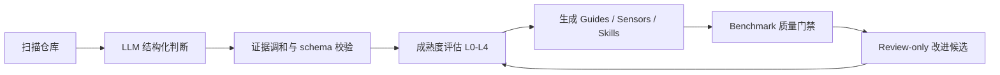

# Harness Builder

**Maturity-driven Self-Improve AI Coding Harness Builder**

Harness Builder 是一个面向既有代码库的 AI Coding Harness 生成器。它扫描真实项目，识别技术栈、模块、风险区域、验证命令和团队规则，生成一套可审查、可验证、可持续演进的项目级 `.ai/` Harness。

它的目标不是“再写一个脚手架”，而是帮助团队把隐性的工程约束转化为 AI Coding 工具可以稳定消费的 Guides、Sensors、Workflow Skills、成熟度报告和改进候选。

> 当前项目仍处于 POC 阶段，不是生产级产品。

## 为什么需要它

AI Coding 在复杂既有代码库中常见的问题不是“模型不会写代码”，而是：

- Agent 不理解项目上下文、架构边界和团队规则。
- 验证命令、风险路径和质量门禁散落在文档、CI、脚本和个人经验里。
- 每次任务依赖临时 prompt，缺少可审计、可复用的执行协议。
- 代码库的 AI Coding 成熟度不可评估，也不知道下一步该补齐什么。
- 任务经验、失败模式和 Review 反馈无法持续反哺项目规则。

Harness Builder 试图补上这一层工程治理：在 Agent 写代码之前，先为项目生成一套可执行、可验证、可演进的 AI Coding Harness。

## 核心亮点

| 能力 | 价值 |
| --- | --- |
| LLM-first 仓库理解 | 面向不规范、遗留、混合技术栈项目，先用 LLM 形成结构化判断，再用 Python 做 schema、证据和契约校验。 |
| 成熟度驱动 | 用 L0-L4 解释当前 Harness 能力、主要阻断项和下一阶段补齐路径。 |
| Guided Init | `init` 是 CLI 中的渐进式协作向导，会展示扫描理解、证据、低置信度边界、生成前预览和写入后交付摘要。 |
| Guides / Sensors / Workflow Skills | 生成项目上下文、编码规则、验证策略、风险升级和 Standard / Lightweight / Bugfix 工作流。 |
| Review-only 改进闭环 | 智能改进不会直接覆盖正式资产，而是生成待审查候选，交给 Harness Maintainer 决策。 |
| Benchmark 质量门禁 | 对 `.ai/` 资产做 schema、章节、引用、风险一致性和 hard gate 证据检查，避免“文件存在但不可用”。 |
| Runtime 分层 | Builder 负责生成项目级 Harness；真实任务执行、`.ai/task-runs` 和 Sensor 结果由宿主 AI Coding Runtime 承载。 |

## 适合谁

Harness Builder 的直接用户是 **Harness Maintainer**：负责让团队 AI Coding Harness 可维护、可审查、可演进的人。

典型角色包括：

- 平台工程 / 工程效能团队。
- 负责 AI Coding 落地的架构师或 Tech Lead。
- 客户现场 FDE / 方案团队 / 客户成功团队。
- 需要治理复杂遗留系统 AI Coding 风险的研发团队。

一线开发者通常是间接受益者：他们通过生成的 Harness 获得更稳定的项目上下文、验证策略、风险提醒和交付摘要。

## 当前能做什么

当前 CLI 名称是 `harness-builder-agent`。

```bash
.venv/bin/harness-builder-agent init --repo <repo>
.venv/bin/harness-builder-agent benchmark --repo <repo>
.venv/bin/harness-builder-agent assess --repo <repo>
.venv/bin/harness-builder-agent improve --repo <repo>
.venv/bin/harness-builder-agent self-improve --repo <repo>
```

常用能力：

- `init`：扫描仓库并生成第一版 `.ai/` Harness。
- `benchmark`：检查生成资产是否满足当前质量门禁。
- `assess`：重新评估 Harness 成熟度。
- `improve`：基于成熟度缺口生成 review-only 改进候选。
- `self-improve`：串联成熟度评估、改进候选、LLM review 和资产候选生成。
- `recommend-workflow`：为具体任务生成 review-only Workflow 推荐。
- `review-candidate` / `review-human-input`：记录候选治理和人工确认决策。

再次运行 guided `init` 时，如果目标仓库已有 `.ai/project-inventory.json` 和 `.ai/harness-config.yaml`，CLI 会进入已有 Harness 维护入口，而不是默认覆盖现有资产。

## 快速开始

### 1. 安装

```bash
python3 -m venv .venv
.venv/bin/python -m pip install --upgrade pip
.venv/bin/python -m pip install -e ".[test]"
```

### 2. 配置 DeepSeek

真实 LLM 扫描需要本地 `.env` 或环境变量。不要提交 `.env`。

```bash
DEEPSEEK_API_KEY=你的 DeepSeek API Key
HARNESS_BUILDER_LLM_BASE_URL=https://api.deepseek.com
HARNESS_BUILDER_LLM_MODEL=deepseek-v4-pro
```

### 3. 初始化一个仓库

交互式 guided init：

```bash
.venv/bin/harness-builder-agent init --repo tests/fixtures/mini-spring-boot
```

自动化 / CI / acceptance 场景必须显式使用非交互模式：

```bash
.venv/bin/harness-builder-agent init --non-interactive --repo tests/fixtures/mini-spring-boot
```

### 4. 运行质量门禁

```bash
.venv/bin/harness-builder-agent benchmark --repo tests/fixtures/mini-spring-boot --profile java-spring
```

首次 `init` 不会默认运行 benchmark。资产生成成功不等于质量门禁通过。

## 生成什么

`init` 会在目标仓库生成 `.ai/` 目录。核心产物包括：

```text
.ai/
  project-inventory.json
  command-catalog.yaml
  harness-config.yaml
  scan-metadata.yaml
  llm-scan-proposal.json
  weapon-library-selection.yaml
  interaction-decisions.yaml
  init-summary.md
  guides/
    project-context.md
    coding-rules.md
    architecture.md
  sensors/
    verification.md
    test-strategy.md
  skills/
    lightweight/SKILL.md
    bugfix/SKILL.md
    standard/SKILL.md
  maturity-report.md
  maturity-score.yaml
  maturity-evidence.yaml
  evolution-plan.md
  experience/
    experience-index.yaml
```

这些产物分成四类：

- **机器契约**：inventory、command catalog、harness config、scan metadata。
- **语义资产**：Guides、Sensors、Workflow Skills、init summary。
- **成熟度资产**：maturity report、score、evidence、evolution plan。
- **审查 / 经验资产**：pending improvements、candidate reports、experience index。

## 工作方式



关键原则：

- LLM 负责提出结构化判断，确定性代码负责校验、调和和落盘。
- DeepSeek / LLM 不可用时显式失败，不静默 fallback。
- 低置信度或证据不足的 hard gate 会降级为 soft gate，并留下人工确认提示。
- 正式 Harness 变更保持克制，高风险内容优先进入 candidate / review-only 状态。
- Runtime 过程数据由宿主 AI Coding Runtime 生成，Builder 当前只读消费。

## 成熟度框架

Harness Builder 用 L0-L4 描述项目 AI Coding Harness 的控制能力：

| 等级 | 含义 |
| --- | --- |
| L0 | 依赖临时 prompt 和个人经验，没有稳定 Harness。 |
| L1 | 有项目规则和上下文文档，但验证与流程尚未成体系。 |
| L2 | 有 Guides、Sensors、Workflow routing 和成熟度报告，能建立初始控制基线。 |
| L3 | Harness 与任务 Workflow 绑定，有 Sensor 结果、Repair Loop 和运行证据闭环。 |
| L4 | 能基于经验、Review、失败模式和成熟度缺口持续生成可审查改进候选。 |

当前 POC 重点服务 `init` 主体验：帮助用户从 L0 建立 L1/L2 基线，并为后续 L3/L4 的 Runtime 和 Self-Improve 闭环留下契约。

## 项目边界

Harness Builder 当前负责：

- 扫描代码库并生成项目级 `.ai/` Harness。
- 生成 Guides、Sensors、Workflow Skills、成熟度报告和 review-only 改进候选。
- 定义 Runtime artifact contract，例如 `harness-map.yaml`、`sensor-report.yaml`、`runtime-summary.yaml`。
- 对已有 `.ai/task-runs/<task-id>/` 进行只读校验和经验消费。

Harness Builder 当前不负责：

- 不提供任务级 `run` 命令。
- 不直接执行 AI Coding 任务。
- 不主动创建 `.ai/task-runs`。
- 不绕过 Harness Maintainer 自动应用高风险改进。

## 开发与验证

快速回归：

```bash
scripts/test-fast.sh
```

常用开发切片：

```bash
scripts/test-unit.sh
scripts/test-integration.sh
scripts/test-guided-init.sh
scripts/test-llm-contracts.sh
scripts/test-acceptance-llm-smoke.sh
scripts/test-acceptance-real-repo.sh
scripts/test-acceptance-self-improve.sh
```

这些切片只用于缩短开发反馈，不能替代 `scripts/test-fast.sh` 或 `scripts/test-full.sh`。

完整本地验收：

```bash
scripts/test-full.sh
```

真实 DeepSeek / 真实开源仓库验收：

```bash
scripts/test-acceptance.sh
```

`tests/acceptance` 需要真实 DeepSeek API Key 和 `.benchmarks/` 下的真实仓库；缺少前置条件时必须失败，不会静默跳过。

## 文档索引

- [AGENTS.md](AGENTS.md)：Codex 项目级规则入口。
- [docs/engineering/architecture.md](docs/engineering/architecture.md)：架构边界和模块职责。
- [docs/engineering/init-workflow.md](docs/engineering/init-workflow.md)：`init` 工作流、产物和失败行为。
- [docs/engineering/llm-contracts.md](docs/engineering/llm-contracts.md)：LLM-first、DeepSeek、Prompt 和 schema 契约。
- [docs/engineering/sensor-and-gate-rules.md](docs/engineering/sensor-and-gate-rules.md)：Sensors、hard gate 和 benchmark 规则。
- [docs/engineering/testing-strategy.md](docs/engineering/testing-strategy.md)：测试分层与验收策略。
- [docs/strategy/README.md](docs/strategy/README.md)：产品规划、North Star 和目标模式运行手册入口。

## 路线图

- **短期**：继续打磨 `init`，让首次初始化更像深度引导式工程顾问，而不是模板生成器。
- **中期**：增强 Workflow routing、Experience index、candidate governance 和真实仓库验收。
- **长期**：演进为企业级 Self-Improve Harness Agent，持续把任务经验、Sensor 反馈和人工 Review 转化为可审查的 Harness 改进。
