# init 工作流规则

本文描述 `harness-builder-agent init` 的业务流程、输入输出、失败行为和测试要求。修改 `init` 命令或其生成产物前，先阅读本文。

## 目标

`init` 的目标是在目标代码库中生成一套可审计、可编辑、可继续演进的 AI Coding Harness 初始资产。

它不是简单创建模板文件，而是要完成：

1. 理解目标仓库当前状态。
2. 识别技术栈、模块、风险、验证命令。
3. 选择稳定的内置 guide/sensor 基线。
4. 生成项目级 guides、sensors、skills 和配置。
5. 暴露需要人工确认的点。
6. 留下 trace，说明过程发生了什么、生成了什么。

## 输入

当前 `init` 主要输入：

- `--repo`：目标仓库路径。
- `--context`：可选的团队规则、组织规范、架构约束等上下文文件。
- `--non-interactive`：显式启用非交互自动化模式，用于测试、CI、脚本和 acceptance。
- 本地 LLM 配置：DeepSeek API key、base URL、model、timeout 等。
- 目标仓库代码、配置、构建文件、CI 文件、文档和测试文件。

`init` 默认是人机引导式向导。非 TTY 环境如果没有显式传入 `--non-interactive`，必须失败并提示用户选择自动化模式，不能静默生成一份未确认的 Harness。

默认 guided `init` 如果检测到目标仓库已经存在 `.ai/project-inventory.json` 和 `.ai/harness-config.yaml`，必须先作为状态感知维护入口展示现有 Harness 摘要。摘要必须先展示面向人的 `维护状态摘要（Maintenance overview）`，用中文解释 benchmark 未运行 / failed / passed、Workflow routing 是否具备 standard escalation 与 risk trigger、Experience / review 是否存在候选或人工确认积压，以及当前 triage 第一动作对应的菜单编号；随后必须把 top actions 渲染成中文 `Maintenance triage guidance`，帮助 Maintainer 理解应先运行哪个 guided action 或查看哪个报告，并展示 `Maintenance action shortcuts`，把可通过 existing Harness 菜单执行的 top action 映射到稳定编号，未知 action 不能伪造编号；随后再进入 `Audit signals` 审计明细，分项展示 Benchmark signals、Workflow routing signals、Experience / review signals 和 raw Maintenance triage lines。Benchmark signals 展示最近 benchmark failed check 数量、最多 3 条 failed check id、中文解释，以及 `error` / `errors` / `missing` / hard gate `weak_commands` 的可行动摘要；Workflow routing signals 展示 default workflow、routing rule count、standard escalation 是否存在、standard 是否要求人工确认、scan risk trigger 数量、最多 3 条 `risk_area:*` trigger，以及 `missing_hard_gate` trigger 是否存在；Experience / review signals 展示 pending improvements、asset candidates、candidate governance、maturity reviews、workflow recommendations、latest workflow recommendation、初始 LLM Guide / Sensor candidates 的 total / pending 数、pending maturity dimensions、top candidate 和 review-only boundary、runtime task runs、self-improve package、human-input-needed 和最近 benchmark 中 schema/content failed checks。human-input-needed 不能只显示 present / missing，存在时必须通过 `Questionnaire` schema 展示 questionnaire 状态、待确认总数、scan 类确认数量、scan follow-up resolved / partially addressed / unaddressed 计数、前几个 interaction id 和 `.ai/human-input-needed.md#处理方式` 入口；latest workflow recommendation 必须来自 `WorkflowRecommendationHistory` 或兼容的 `WorkflowRecommendationReport` schema 校验结果，展示 task、workflow、risk、review status 和 source；初始 LLM Guide / Sensor candidates 必须来自 `WeaponLibraryCandidateReport` schema 校验结果，pending 只按 `status=candidate` 或 `human_confirmation_required=true` 计算，并且作为独立维护对象展示，不得复用 `.ai/review/asset-candidates.yaml` 的治理语义；缺失文件必须显示为 missing / not_available，不能伪装成成功。摘要还必须展示只读 Maintenance triage top actions，把结构化信号排序成最多 3 条下一步动作，每条包含 action、reason、source、next guided action 和可选 detail；hard gate command evidence 失败且 report 携带 weak command 时，triage 应显示 `reason=hard_gate_command_evidence` 和 `detail=<command_id>:<reason>:<source>`，并优先于泛化 schema/content failed checks；scan-report 或 init-summary evidence audit 失败且 report 携带 missing 时，triage 应显示 `reason=scan_evidence_audit_incomplete` 和第一条 missing detail；project-context evidence context 失败且 report 携带 missing 时，triage 应显示 `reason=project_context_evidence_incomplete` 和第一条 missing detail；初始 LLM Guide / Sensor candidate 仍待确认时，triage 应显示 `reason=weapon_library_candidates_pending`、`source=.ai/experience/weapon-library-candidates.yaml`、top candidate maturity dimension detail，并推荐 `review-initial-candidate` 记录 `accepted` / `rejected` / `kept`；未解决或部分回应的 scan follow-up 存在时，triage 应显示 `reason=human_input_scan_followups_pending`、`source=.ai/questionnaire.yaml`、待处理数量和首个 interaction id，并推荐 `review-human-input`。triage 只做维护动作路由，不重新计算成熟度、不执行动作、不覆盖正式资产。可选动作必须提供稳定编号菜单，并同时接受英文命令和常见中文别名；默认选择 `1` 表示只读退出，不能因为有推荐编号就自动执行推荐动作。当前至少支持 `1. exit` 只读退出，不扫描、不覆盖正式 Harness 资产；支持 `2. assess` 复评成熟度，只刷新 `.ai/maturity-score.yaml`、`.ai/maturity-report.md`、`.ai/maturity-evidence.yaml` 和 `.ai/init-summary.md`；支持 `3. improve` 先刷新 Experience index 与 maturity evidence，再生成 review-only 改进候选，只写 `.ai/improvement-candidates.yaml`、`.ai/evolution-plan.md`、`.ai/experience/pending-improvements.md` 和 `.ai/experience/experience-index.yaml` 等改进相关产物，不覆盖正式 Guides、Sensors、Workflow Skills 或配置；支持 `4. benchmark` 运行 Harness 质量门禁，刷新 `.ai/benchmark-report.yaml` 以及 benchmark 内部复用的 maturity / improvement 派生产物，输出 hard status、quality status 和失败项摘要，不覆盖正式 Guides、Sensors、Workflow Skills、配置、inventory 或扫描产物；支持 `5. recommend-workflow` 收集任务说明和 task id，调用 LLM workflow router 生成最新 `.ai/review/workflow-routing-recommendation.*`，追加 `.ai/review/workflow-routing-recommendations/` 历史索引和摘要，并刷新 Experience / Maturity 派生证据；该动作必须在输出和 trace artifacts 中列出 latest recommendation、history index 和 history summary，并保持 review-only，不执行 Runtime、不创建 `.ai/task-runs`、不修改正式 routing policy，LLM 不可用或 schema 无效时必须显式失败；支持 `6. review-candidate` 记录 `.ai/review/asset-candidates.yaml` 中候选的 `accepted`、`deferred` 或 `rejected` 决策，也支持对单个 Guide / Sensor 候选显式 `applied` 并刷新 `.ai/review/candidate-governance.*` 与 Experience index；guided `review-candidate` 在询问 decision 前必须展示 apply preview，说明 target、append mode、重复 marker 状态和 unified append diff 片段；guided `review-candidate` 的 `applied` 不支持 `workflow_policy`，不能修改 Workflow Skills 或从自由文本推断配置变更，需要应用 workflow policy 候选时必须使用专家命令；支持 `7. review-human-input` 治理 `.ai/questionnaire.yaml` 中已有 `scan_followup_confirmation`，输入 interaction id、`resolved` 或 `reopened`、理由和 reviewer 后，只更新 `.ai/questionnaire.yaml`、`.ai/human-input-needed.md` 与 `.ai/review/human-input-governance.*`，不修改正式 Guides、Sensors、Workflow Skills、配置、inventory 或扫描产物，也不创建 `.ai/task-runs`；支持 `8. self-improve` 显式运行 maturity assessment、deterministic improvements、LLM maturity review 和 LLM asset candidate generation，生成 `.ai/review/self-improve-package.*` 等 review-only 产物，不执行 Runtime、不创建 `.ai/task-runs`、不应用正式资产，LLM 不可用或 schema 无效时必须显式失败；显式选择 `9. reinit` 后才继续进入重新扫描和生成流程；选择后必须在重新扫描确认前说明这是对现有 Harness 的重新生成，接下来会重新扫描，最终 `confirm` / `确认` 前不会覆盖现有正式 Harness 资产；如果在重新扫描前取消，必须输出中文取消摘要，说明未重新扫描、未覆盖正式 Harness 资产、未创建 Runtime 产物，并在 trace summary 中保留 `existing_harness_action=reinit` 和 `cancelled=true`；支持 `10. review-initial-candidate` 对 `.ai/experience/weapon-library-candidates.yaml` 中的初始 LLM Guide / Sensor 候选记录 `accepted` / `rejected` / `kept` 决策，刷新 `.ai/review/weapon-candidate-governance.*` 与候选 Markdown，不修改正式 Harness 资产，也不创建 `.ai/task-runs`。`--non-interactive` 仍保留自动化重新生成语义。

显式 `reinit` 最终确认并完成重新生成时，trace summary 必须保留 `existing_harness_action=reinit`，同时 CLI 仍必须展示 `== 初始化完成 ==` 交付摘要；其他已有 Harness 维护动作仍不得追加首次初始化交付摘要。显式 `reinit` 在继续扫描后如果扫描阶段因为 DeepSeek / LLM 配置、网络或 schema 错误失败，必须按 guided 扫描失败处理，trace summary 必须保留 `existing_harness_action=reinit`、`scan_completed=false`、`formal_assets_written=false`、`error_type` 和 `scan_error`，并且不得覆盖正式 Harness 资产或创建 Runtime 产物。

已有 Harness 维护入口的 action prompt 遇到未知输入时，必须明确提示有效动作并重新等待输入，不能把未知输入静默当作 `exit`。内部 action runner 如果收到绕过 prompt 的未知 action，也必须显式失败并记录 `unknown_existing_harness_action`，不能伪装成用户主动只读退出。

已有 Harness 维护入口读取 `.ai/project-inventory.json`、`.ai/harness-config.yaml` 和已存在的 `.ai/maturity-score.yaml` 时，必须执行 schema / YAML / JSON 校验。任一核心状态文件损坏、格式非法或 schema 不匹配时，必须在 CLI 中明确说明“已有 Harness 读取失败”、指出具体文件、说明未重新扫描、未覆盖正式 Harness 资产且未创建 Runtime 产物，并以 `existing_harness_state_invalid` 失败 trace 结束。不得把损坏状态静默当成缺失成熟度、只读退出或重新初始化，也不得 fallback 到扫描生成。

默认 guided `init` 如果只发现 `.ai/project-inventory.json` 或 `.ai/harness-config.yaml` 中的一部分 core 文件，必须在第一次 `继续生成 Harness?` 确认前说明这是“不完整 Harness 状态”，列出已存在和缺失的 core 文件，说明因此不会进入已有 Harness 维护入口；继续后会按首次 init 重新扫描，但最终 `confirm` / `确认` 前仍不会覆盖正式 Harness 资产。`.ai/runs` 等 trace 目录不能被当成 partial Harness core。

guided `init` 取消必须留下可审计 trace summary。启动确认阶段取消时，summary 必须包含 `cancelled=true`、`cancel_stage=startup_confirmation`、`scan_completed=false`；扫描完成、进入写入前预览或最终确认阶段后取消时，summary 必须包含 `cancelled=true`、`cancel_stage=prewrite_confirmation`、`scan_completed=true`、`primary_stack` 和 `command_count`。如果本轮来自 existing Harness `reinit`，取消 summary 还必须保留 `existing_harness_action=reinit`。取消不得写入或覆盖正式 Harness 资产，不得创建 Runtime 产物。

如果 `review-human-input` 是由 human-input triage 推荐的动作，并且 triage detail 中存在首个待处理 scan follow-up interaction id，guided action 的 interaction id prompt 应把该 id 作为默认值，允许 Maintainer 直接回车处理推荐项；Maintainer 仍可输入其他 id 覆盖。没有默认 id 时不得猜测或 silent fallback，空 id 继续由 `review-human-input` 显式失败。

## 主流程

```mermaid
flowchart LR
  A["CLI: init"] --> B["collect evidence"]
  B --> C["LLM scan proposal"]
  C --> D["reconcile scan result"]
  D --> E["select weapon library"]
  E --> F["read context inputs"]
  F --> G["collect interaction decisions"]
  G --> H["write core assets"]
  H --> I["write guides/sensors/skills"]
  I --> J["write confirmation/candidates"]
  J --> K["write trace/artifacts"]
```

### 1. Evidence 收集

Evidence 收集负责从目标仓库抽取事实，例如：

- 关键文件列表。
- 构建文件。
- CI 文件。
- 文档片段。
- 源码样本。
- 测试相关文件。
- 配置文件。

规则：

- Evidence 是事实输入，不是最终判断。
- 不应该假设企业代码库一定符合标准目录结构。
- 不应该因为没找到 `tests/` 就断定项目没有测试。
- 初始 evidence 之后可以执行 LLM-guided evidence expansion：LLM 只能从已发现文件索引中请求少量补充文件，Python 负责路径 allowlist 校验和摘要读取，再把补充文件作为 `llm_requested_files` 提供给最终 LLM scan。
- 首次 guided `init` 在进入阻塞式仓库扫描前，必须先输出用户可见的“扫描仓库”阶段说明，说明将收集仓库文件、构建配置、CI、测试、文档证据，并会请求 LLM 做结构化扫描和 schema 校验。
- 首次 guided `init` 必须通过 `scan_repository()` 的 progress callback 展示内部扫描阶段：收集仓库 evidence、请求 LLM 规划补充 evidence、读取 LLM 请求的补充 evidence、请求最终 LLM 结构化扫描、调和扫描结果。内部事件 id 保持英文稳定，CLI 文案负责中文翻译；该进度只用于用户可见状态和测试观察，不改变扫描决策。
- guided 扫描成功后，必须在“扫描发现”之前输出“扫描完成”，说明 evidence 收集、LLM 结构化分析和扫描调和已经完成。
- guided 扫描失败时，必须说明失败发生在扫描阶段、原因摘要、未写入正式 Harness 资产，以及建议检查 LLM 配置、网络或扫描错误；随后继续显式失败，不能吞异常或使用确定性 fallback。失败 trace 必须以 `scan` 阶段记录错误类型和短错误消息，并把 `trace.yaml` 标记为 `failed`，summary 必须包含 `scan_completed=false` 和 `formal_assets_written=false`；如果本轮来自 existing Harness `reinit`，summary 还必须保留 `existing_harness_action=reinit`。CLI 应以失败退出码结束，但不向用户展示原始 Python traceback，也不额外写入会混淆阶段定位的外层 `init failed` 事件。
- `--non-interactive` 自动化路径不承担 guided CLI 进度展示契约，避免改变 CI、脚本和 acceptance 的输出语义；但如果扫描阶段失败，也必须输出短错误说明、标出 `scan` 阶段、错误类型、未写入正式 Harness 资产和检查 LLM / 网络 / 扫描错误的建议，并以 `scan` failed trace 结束，不额外写入会混淆阶段定位的外层 `init failed` 事件。

### 2. LLM 结构化扫描

LLM 扫描负责基于 evidence 识别技术栈、模块、架构信号、风险和命令候选。

规则：

- LLM 输出必须是结构化 JSON，并通过 schema 校验。
- LLM 失败、超时、schema 失败必须显式失败。
- 不允许用确定性扫描 fallback 成功结果。
- 原始 LLM proposal 必须落盘，便于审计。

### 3. Scan reconcile

调和阶段负责把 LLM proposal 和 evidence 合成为稳定的项目清单和命令目录。

规则：

- LLM 声称的 stack 必须能被 evidence 支持，否则要降级或标记风险。
- 命令候选必须包含来源、置信度和 gate 类型。
- 对明显危险、缺乏证据或过重的命令，不能盲目标记为 hard gate。
- 首次 guided `init` 在询问是否继续生成 Harness 之前，必须输出稳定的 `== 启动说明 ==` 区块，说明本次将扫描哪些 evidence、后续需要用户确认或补充哪些关键判断、最终确认写入后会生成哪些正式 Harness 资产，以及本次不会执行 Runtime、不会创建 `.ai/task-runs`、不会默认运行 benchmark、最终输入 `confirm` / `确认` 前不会写入或覆盖正式 Harness 资产。generation trace 可以从会话开始记录取消、失败和完成过程，但必须在文案中与正式 Harness 资产写入边界区分。
- 首次 guided `init` 在收集用户 scan 补充前，必须把调和后的扫描结果翻译成面向用户的关注点分组，至少包含风险区域、不确定性、验证缺口和建议补充。
- 风险区域来自 LLM / scan reconcile / 用户补充已确认前的 `risk_areas` 线索，只能作为关注点展示，不能伪装成已验证事实。
- 不确定性必须覆盖 LLM 低置信度、scan warning、需要人工确认、模块边界不清或低置信度命令等用户需要优先确认的事项。
- 验证缺口必须说明当前扫描未确认的 hard gate、低置信度命令、soft gate 边界和缺失的 build / test / lint / typecheck 入口；缺口表达必须使用“当前扫描未确认 / 建议补充”，不能断言项目一定不存在这些能力。
- 首次 guided `init` 在展示扫描关注点后、收集用户 scan 补充前，必须展示“扫描后的成熟度初评”：说明当前 Harness 从 L0 起步或存在 partial Harness、按当前扫描写入后预计建立的成熟度基线、下一目标、主要差距，以及用户补充模块、验证命令、风险区域、团队规则或测试策略会如何影响成熟度判断和后续 Harness 推荐。

### 4. 武器库选择

武器库选择负责从内置基线中挑选适合当前技术栈的 guide/sensor。

规则：

- `common` 武器库应始终参与。
- 识别出的 primary stack 对应武器库应参与。
- 选择结果必须写入文件，便于测试和人工审查。
- LLM 提出的新增规则只能作为 candidate，不能自动晋升为正式规则。

### 5. 写入前成熟度初评与设计预览

首次 guided `init` 在正式写入 `.ai/` 前，必须展示面向用户的成熟度初评和 Harness 设计预览。

规则：

- 如果目标仓库没有完整 `.ai/project-inventory.json` 和 `.ai/harness-config.yaml`，CLI 必须明确说明当前 Harness 从 L0 起步。
- 预览可以基于内存中的扫描结果、命令目录、默认 `HarnessConfig` 和武器库选择计算写入后预计建立的成熟度基线，但不能提前写入正式资产。
- CLI 必须区分“当前状态”和“确认写入后预计建立的基线”，不能把 planned baseline 伪装成已存在成熟度。
- 预览必须展示下一目标、主要阻断项、推荐补齐动作、将生成的 Guides、将生成的 Sensors、待确认与低置信度边界和 Workflow routing。
- 预览必须展示将生成的 Workflow Skills，至少覆盖 `lightweight`、`bugfix` 和 `standard` 的 Skill 路径、关键阶段、对应 routing rule，以及这些 routing rule 引用的 Guides / Sensors；完整执行协议仍以 `.ai/skills/*/SKILL.md` 和 `harness-config.yaml` 为准。
- 预览必须展示待确认与低置信度边界：如果当前扫描存在 `scan_metadata.followup_questions`、`scan_metadata.self_check.resolutions`、scan warning 或低置信度验证命令，CLI 必须在最终确认前摘要展示数量、示例 interaction id / trigger / action type / command source，并明确确认写入不会自动关闭追问、不会把低置信度内容伪装成已验证事实，也不会创建 `.ai/task-runs`。没有额外待确认项时，也要提醒写入后仍需 benchmark 和未来 Runtime task-run 证据验证。
- Workflow routing 预览必须覆盖 `bugfix-intent`、`low-risk-lightweight` 和 `standard-escalation`，说明高风险、跨模块、安全、数据或影响不清任务会升级到 `standard`；如果当前扫描或用户结构化补充提供了风险路径，预览必须使用与正式 `harness-config.yaml` 相同的配置构造逻辑展示对应 `risk_area:<path>` trigger，不能只展示静态默认 routing 模板。
- Guide / Sensor 推荐项必须逐项说明关联成熟度、解决阻断和下一阶段贡献，帮助用户理解推荐不是模板拼装，而是围绕当前成熟度缺口建立基线。
- 推荐项成熟度关联可以来自内存中的 `MaturityReport` 和内置 weapon tags；该说明是写入前 preview 叙事，不改变 `maturity-score.yaml`、`weapon-library-selection.yaml` 或正式资产 schema。
- 面向用户的预览不能直接展开 `overall_level`、`dimension_scores`、`primary_stack` 等内部字段名；机器消费字段只落在 JSON / YAML 产物中。
- 用户在最终确认阶段返回修改 scan 后，下一次预览必须基于更新后的 inventory / commands 重新计算。
- 写入前预览必须展示扫描补充约束：如果用户补充或修正了技术栈、模块、验证命令、风险区域或自然语言 scan 说明，CLI 必须列出当前生效补充，并说明它们会影响 project inventory、command catalog、risk hints、Guides、Sensors、Workflow 升级和人工确认；这些补充仍是用户提供信息，不能伪装成已验证扫描事实。没有 scan 补充时，也要明确当前按扫描基线、团队规则和内置 Harness 基线生成。

### 6. 用户补充复述与影响说明

首次 guided `init` 收到 scan 补充后，必须在进入团队规则、候选审查和 Workflow 设计之前立即复述系统如何理解这些补充，并说明它们会如何影响成熟度缺口判断、Guides、Sensors、Workflow 升级或人工确认。最终确认前还必须再次汇总用户已经提供的扫描补充、团队规则和 Workflow 补充，并说明这些补充会影响哪些后续决策或产物。

规则：

- 结构化 scan 补充必须说明会影响 project inventory、command catalog、risk hints、Guides、Sensors 或写入前成熟度预览。
- 如果用户输入的 `stack=`、`module=`、`command=` 或 `risk=` 片段格式不完整或字段非法，CLI 必须明确说明该片段未进入结构化 scan 补充，只作为自然语言补充保留，并给出对应可用格式提示；不能让用户误以为 command 已进入 command catalog、module 已进入 project inventory、risk 已进入 risk hints 或 stack override 已生效。
- 自然语言 scan 补充必须明确标记为人工补充说明，进入 `interaction-decisions.yaml`、`project-context.md` 和 `human-input-needed.md`，不能伪装成扫描事实。
- `interaction-decisions.yaml` 中的 `scan_confirmation` 必须在存在 `stack`、`module`、`command`、`risk` 或自然语言 scan 补充时记录机器可读的 `modules`、`commands`、`risk_areas`、`impact_scopes`、`review_status=pending_harness_maintainer_review` 和 `fact_effect=user_supplied_correction_review_required`；无 scan 补充时必须保持空结构化字段、`review_status=not_required` 和 `fact_effect=not_applicable`，避免后续 self-improve 或审计把用户补充误判为已由扫描 evidence 验证的事实。
- scan 补充的即时复述必须发生在 `_apply_scan_overrides()` 更新内存态 inventory / command catalog 之后，让用户知道后续 weapon selection、maturity preview 和正式资产生成将基于已吸收的补充继续推进。
- 用户在最终确认阶段返回 scan 重新输入补充时，新的 scan 补充必须替换上一版 scan 补充，而不是叠加旧 module / command / risk 到正式 project inventory 或 command catalog；最终 `.ai` 资产只能保留最新 scan 修正。
- 用户在最终确认阶段返回 scan 且上一版 scan 补充非空时，CLI 必须明确说明新输入会替换上一版补充，直接回车会清空上一版补充；如果用户输入新的 scan 补充，CLI 必须输出“上一版补充 / 当前生效补充”的替换结果，说明最终写入只会使用当前生效补充；如果用户直接回车清空旧补充，CLI 必须输出可见确认，说明后续预览和正式资产会按扫描基线继续。
- 用户在最终确认阶段返回 scan 后，CLI 必须刷新候选项并清空上一轮 candidate 审查决策，避免旧 scan 状态下的 `accepted` / `rejected` / `edited` 静默套用到当前扫描理解；如果刷新后仍有候选项，必须立即按当前扫描状态重新逐项审查候选，最终只把这次新审查的 candidate decision 写入正式 `.ai` 产物。
- 用户在最终确认阶段返回 scan 后，如果刷新后没有候选项，下一次最终确认摘要必须明确暂无候选；如果已重新逐项审查，下一次最终确认摘要必须展示本轮新审查的确认 / 拒绝 / 备注 / 保持统计。
- 团队规则必须说明会进入团队上下文 Guide 和 `human-input-needed.md`。
- 首次 guided `init` 收到团队规则后，必须在进入候选审查前立即复述这些规则，并说明它们会进入 `interaction-decisions.yaml`、`project-context.md` 和 `human-input-needed.md`；CLI 必须明确团队规则是用户提供的约束，不能被当作扫描事实。
- `interaction-decisions.yaml` 中的 `context_confirmation` 必须在存在 `--context` 文件或交互式团队规则时记录机器可读的 `impact_scopes`、`review_status=pending_harness_maintainer_review` 和 `policy_effect=context_only_no_direct_policy_change`；无团队规则 / 无 context 输入时必须保持 `review_status=not_required` 和 `policy_effect=not_applicable`，避免后续 self-improve 或人工审计把团队规则自由文本误判为已应用的正式 policy。
- 写入前 Harness 设计预览必须展示团队规则约束；如果没有团队规则输入，也要说明当前按扫描证据和内置 Harness 基线生成。
- 最终确认阶段返回团队规则且上一版团队规则非空时，CLI 必须说明新输入会替换上一版团队规则，直接回车会清空上一版团队规则；如果用户直接回车清空旧规则，CLI 必须输出可见确认，说明后续预览和正式资产将不再保留这些团队规则。
- Workflow 补充必须说明会进入 Workflow 说明和人工确认记录；除非经过候选治理或结构化 policy patch，不能直接修改正式 routing policy。
- 首次 guided `init` 的推荐 Workflow 阶段必须在收集 Workflow 补充前同时展示 `lightweight`、`bugfix` 和 `standard` 三类工作流；`standard` 说明必须覆盖复杂、高风险、跨模块、安全 / 数据或影响不清任务会升级到更完整流程。`interaction-decisions.yaml` 的 `workflow_confirmation.shown_workflows` 应记录这三类已展示工作流。
- 首次 guided `init` 收到 Workflow 补充后，必须在进入写入前 preview / 最终确认前立即复述这些补充，并说明它们会进入 `interaction-decisions.yaml`、`project-context.md` 和 `human-input-needed.md`；CLI 必须明确 Workflow 补充是 review-only 的人工说明，不直接修改正式 workflow routing policy。
- `interaction-decisions.yaml` 中的 `workflow_confirmation` 必须在存在 Workflow 补充时记录机器可读的 `impact_scopes`、`review_status=pending_harness_maintainer_review` 和 `routing_policy_effect=review_only_no_direct_policy_change`；无 Workflow 补充时必须保持 `review_status=not_required` 和 `routing_policy_effect=not_applicable`，避免后续 self-improve 或人工审计把自由文本误判为已应用的正式 routing policy。
- 写入前 Harness 设计预览必须展示 Workflow 补充约束；如果没有 Workflow 补充，也要说明当前按内置 bugfix / lightweight / standard routing 预览。
- 最终确认阶段返回 Workflow 补充且上一版 Workflow 补充非空时，CLI 必须说明新输入会替换上一版 Workflow 补充，直接回车会清空上一版 Workflow 补充；如果用户直接回车清空旧补充，CLI 必须输出可见确认，说明后续预览和正式资产将不再保留这些 Workflow 补充。
- 最终确认摘要不能只显示补充数量，必须展示具体补充内容的可读摘要，让用户在写入前确认系统理解了输入。
- 最终确认阶段输入 `back` / `返回` 时，必须允许返回 scan / 扫描、rules / 团队规则、candidates / 候选或 workflow / 工作流补充；用户也可以在最终确认输入处直接输入这些返回目标，跳过二次目标选择。返回 rules / workflow 后重新输入的补充必须替换旧内存态，并触发对应即时复述和写入前 preview，最终只把最新补充写入正式 `.ai` 资产。
- 最终确认阶段只有空回车默认确认或显式输入 `confirm` / `确认` 才能写入正式 `.ai` 资产；输入 `back` / `返回` 返回修改，输入 `cancel` / `取消` 取消。其他未知非空输入必须明确提示有效选项并继续等待，不得静默当作 `confirm`。

### 7. 资产写入

资产写入负责生成 `.ai` 下的核心产物。

必须生成的机器消费产物：

- `.ai/project-inventory.json`
- `.ai/command-catalog.yaml`
- `.ai/harness-config.yaml`
- `.ai/scan-metadata.yaml`
- `.ai/llm-scan-proposal.json`
- `.ai/weapon-library-selection.yaml`
- `.ai/context-inputs.yaml`
- `.ai/questionnaire.yaml`
- `.ai/interaction-decisions.yaml`
- `.ai/maturity-evidence.yaml`
- `.ai/experience/experience-index.yaml`

其中 `.ai/context-inputs.yaml` 和 `.ai/questionnaire.yaml` 是人机确认流程的机器消费契约，必须分别通过 `ContextInputs` 和 `Questionnaire` schema 校验；`questionnaire` 必须保留稳定的 interaction id，供 benchmark 和后续人工确认流程引用。LLM-guided evidence expansion 低置信度时，`questionnaire` 必须包含稳定的 `confirm:evidence-expansion` 待确认项，说明 planner 请求路径、实际读取路径、关注风险和规划原因。

其中 `.ai/scan-metadata.yaml` 是扫描链路审计契约，必须通过 `ScanMetadata` schema 校验。它不仅记录 LLM scan prompt version、coverage、warnings 和 reasoning summary，还必须在执行 LLM-guided evidence expansion 时记录 `evidence_expansion`：planner prompt version、requested paths、risk focus、rationale、planner confidence、实际读取 paths 和读取文件数量。首次 guided `init` 的 CLI 必须把这些信息翻译为“LLM 深度补充”分组，让用户在补充上下文前看到补读原因、请求路径、实际读取路径和置信度。planner 低置信度时应进入 scan warning、human confirmation 信号、`questionnaire.yaml` 和 `human-input-needed.md`，不能被包装成完全可信的扫描结果。

`ScanMetadata` 还必须在 coverage gap、LLM stack claim 缺少 evidence、primary stack unknown、模块边界不清或测试 evidence 缺失时记录 `followup_questions`。这些问题是面向 Maintainer 的扫描补救追问，必须包含稳定 interaction id、trigger、question、reason、evidence、confidence 和影响范围。首次 guided `init` 的 CLI 必须把它们展示为“深度追问”，并在收集 scan supplement 前展示“深度追问回答建议”，把 coverage、stack、module boundary、test evidence 等 trigger 翻译成可用自然语言说明或 `stack=<value>`、`module=路径|类型|名称`、`command=ID|命令|类型|gate|来源|置信度`、`risk=路径|原因` 示例。`questionnaire.yaml` 必须把 follow-up questions 转成 `scan_followup_confirmation`，`human-input-needed.md` 必须保留相同 id 和问题。follow-up questions 只是补救入口，不代表 Builder 已经修正扫描结论。如果同轮 guided `init` 中用户通过 `stack`、`module`、`command` 或 `risk` 提供了与某个 follow-up 相关的信息，`questionnaire.yaml` 必须在该 follow-up question 上写入 `response_status=partially_addressed_by_current_scan_supplement` 和稳定 `response_sources`（例如 `command=unit_test:mvn test`、`module=src/main/java`、`risk=src/main/java/...`），并在 reason 中标注“本轮 scan 补充可能已部分回应”、补充摘要和 `review_status=pending_harness_maintainer_review`；未匹配补充时保持 `response_status=unaddressed` 和空 `response_sources`。该标注不能自动关闭追问，不能把用户补充伪装成扫描 evidence，也不能删除人工复核入口。Maintainer 可以通过 standalone `review-human-input --decision resolved|reopened` 显式治理单个 `scan_followup_confirmation`：`resolved` 写入 `response_status=reviewed_resolved_by_harness_maintainer` 和 `.ai/review/human-input-governance.*`，只表示人工复核完成，不表示 Builder 自动重扫或验证了事实；`reopened` 根据是否仍有 `response_sources` 恢复为 partial 或 unaddressed。已有 Harness 维护入口读取 `questionnaire.yaml` 时，应展示 scan follow-up resolved / partial / unaddressed 计数，帮助 Maintainer 区分“已人工关闭”、“已有补充但仍待复核”和“完全未回应”；未解决或部分回应的 scan follow-up 还应进入 Maintenance triage，并推荐 guided `review-human-input`。

当 `followup_questions` 非空时，真实 LLM init 链路可以执行一轮 review-only LLM 二次自检，并把结果写入 `ScanMetadata.self_check`。`self_check` 必须包含 prompt version、`pending_harness_maintainer_review`、overall risk、summary 和逐个 follow-up 的 resolution，说明当前 evidence 是否支持、是否冲突、是否仍需要人工确认或后续 targeted scan。每条 resolution 必须保留结构化 `suggested_action_type`，枚举下一步是补 `stack`、`module`、`command`、`risk`、复核当前 evidence、运行 targeted scan 或交给 Maintainer 复核；新 LLM self-check response 缺少该字段时必须显式失败，旧 metadata 读取可以兼容默认人工复核。首次 guided `init` 的 CLI 必须把它展示为“LLM 二次自检”，并明确它不会自动修正 `ProjectInventory`、`CommandCatalog`、Guides、Sensors、Workflow routing 或正式 Harness 资产；`questionnaire.yaml` 可以把对应 self-check resolution 的 status、action type、动作提示、建议和理由追加到 follow-up confirmation 的 reason，帮助 Maintainer 判断下一步。

其中 `.ai/maturity-evidence.yaml` 是成熟度评估和后续 LLM maturity reviewer 的确定性输入摘要，必须汇总 inventory、command catalog、Harness assets、generation trace、experience、benchmark 和可选 Runtime task-run 可用性。Harness assets evidence 必须包含 workflow routing rule 明细，包括 rule id、selected workflow、task type hints、triggers、required guides、required sensors、human confirmation 和 rationale，便于 LLM review / asset candidate generation 基于路由策略做语义判断。Experience evidence 应优先消费 `.ai/experience/experience-index.yaml`，以暴露 pending improvement、asset candidate、candidate governance、maturity review、workflow recommendation review 和 Runtime task-run 统计，并保留对应 source path / kind / item_count 明细；Observability evidence 在 `.ai/task-runs/<task-id>/` 存在时必须只读校验并汇总 schema-valid task-run 数量、failed / skipped / unresolved sensor 数、repair attempts 和 source paths；成熟度评分必须把 Runtime task-run 作为运行证据门禁：全部 resolved 的 Runtime sensor 结果可以支撑 workflow / observability / governance / repair loop 维度提升和 Workflow-bound L3，failed / skipped / unresolved sensor 必须形成 blocker 并阻止 L3；如果显式运行 `summarize-experience` 后存在 `.ai/experience/experience-summary.yaml`，还必须记录 Experience Summary 可用性和 finding 数量；对旧版本生成且尚无 index 的 Harness，可保留只读取 `.ai/experience/pending-improvements.md` 的兼容路径。

其中 `.ai/experience/experience-index.yaml` 是 Experience 资产的机器消费索引，必须记录已存在的 Experience Markdown、pending improvement 数量、asset candidate 数量、candidate governance 决策数量、maturity review 数量、workflow recommendation review 数量和可选 Runtime task-run 数量。workflow recommendation 计数优先读取 `.ai/review/workflow-routing-recommendations/index.yaml` 的历史条数；旧 Harness 没有 history index 时才兼容单个 `.ai/review/workflow-routing-recommendation.yaml`。Runtime task-run 计数必须来自 schema-valid `.ai/task-runs/<task-id>/`，而不是裸目录数量；无 task-runs 时记录 warning，存在但 schema 或跨文件一致性无效时显式失败。它由 Builder 在初始化、`improve`、候选资产生成、候选治理、`recommend-workflow` 和 Experience Summary 后刷新；候选资产生成写出 `.ai/review/asset-candidates.yaml` 后还必须重新生成 `.ai/maturity-score.yaml` 和 `.ai/maturity-evidence.yaml`，让 review-only asset candidate 数量立即进入成熟度和维护入口证据面；Builder 只读消费 `.ai/task-runs` 的宿主 Runtime 过程数据，不主动生成该目录。

成熟度评分中的 Experience 维度应优先消费 `.ai/experience/experience-index.yaml` 的结构化计数，包括 workflow recommendation review 计数；旧版本 Harness 缺少 index 时才使用 pending improvement 文件存在性作为兼容判断。

`improve` 应把非零 workflow recommendation review 计数转成待审核的 `workflow_policy_update` 候选，指向 `.ai/harness-config.yaml`；不得直接修改正式 routing policy。`improve` 还应读取 `.ai/interaction-decisions.yaml` 中 pending review 且 `routing_policy_effect=review_only_no_direct_policy_change` 的 `workflow_confirmation.notes`，把 guided `init` 收到的 Workflow 补充转成 review-only 的 `workflow_policy_update` 改进候选，并引用 `.ai/interaction-decisions.yaml` / `.ai/human-input-needed.md` 作为证据来源；该候选只表示需要审查是否调整 routing policy，不能由确定性代码从自由文本 Workflow 补充直接生成 `WorkflowPolicyPatch`，也不能修改 `.ai/harness-config.yaml`。后续 `review-maturity` / `generate-asset-candidates` 可以在 LLM 审查支持或修订该候选时生成 review-only `workflow_policy` asset candidate，但必须携带结构化 `WorkflowPolicyPatch`、保持 `pending_harness_maintainer_review`，并继续等待显式候选治理应用。

`recommend-workflow` 写出最新 `.ai/review/workflow-routing-recommendation.*` 后，还必须写出不可覆盖的 `.ai/review/workflow-routing-recommendations/<recommendation_id>.*`、`.ai/review/workflow-routing-recommendations/index.yaml` 和 `.ai/review/workflow-routing-recommendations.md`，再刷新 `.ai/experience/experience-index.yaml`、`.ai/maturity-score.yaml` 和 `.ai/maturity-evidence.yaml`，让多次推荐证据立即进入后续 maturity / improve 链路；该刷新不能生成 `.ai/task-runs`，也不能应用正式 routing policy 变更。

`review-initial-candidate` 写出 `.ai/review/weapon-candidate-governance.yaml` 和 `.ai/review/weapon-candidate-governance.md` 后，benchmark 必须把它们作为可选 review-only治理产物校验：不存在时不失败，存在时校验 schema、Markdown 配对章节、candidate id / type、source report、decision 到 new status 的一致性、candidate report 当前 status / human confirmation required 同步，以及 `review_only_no_formal_asset_change` 边界。`.ai/experience/weapon-library-candidates.yaml` 中的初始候选在治理后可以是 `confirmed` 或 `rejected`，不能再被 benchmark 固定要求为全部 `candidate`。

必须生成的语义上下文产物：

- `.ai/scan-report.md`
- `.ai/init-summary.md`
- `.ai/maturity-report.md`
- `.ai/evolution-plan.md`
- `.ai/human-input-needed.md`
- `.ai/guides/project-context.md`
- `.ai/guides/coding-rules.md`
- `.ai/guides/architecture.md`
- `.ai/guides/task-templates/bugfix.md`
- `.ai/guides/task-templates/lightweight-feature.md`
- `.ai/sensors/verification.md`
- `.ai/sensors/test-strategy.md`
- `.ai/experience/project-experience.md`
- `.ai/experience/repair-patterns.md`
- `.ai/experience/sensor-feedback.md`
- `.ai/experience/team-preferences.md`
- `.ai/experience/pending-improvements.md`
- `.ai/experience/deprecated-experience.md`

其中 `.ai/scan-report.md` 是扫描过程的可审计报告，必须保留 `## Evidence`、`## LLM Evidence Expansion`、`## Evidence Coverage`、`## Stack Evidence Validation`、`## Scan Warnings`、`## Risk Areas` 和 `## Command Candidates` 章节。它应把 inventory evidence、文档、配置、CI、coverage bucket selected paths、evidence expansion requested/read paths、risk focus、confidence、read file count、rationale、stack validation、scan warning、风险路径和命令候选置信度翻译成可读 Markdown。该报告是 Maintainer 审计扫描深度的入口，不替代 `scan-metadata.yaml` 的机器契约；benchmark 必须用 `content:scan-report` 防止这些审计细节漂移。

`ProjectInventory.evidence`、`documents`、`configs` 和 `ci_files` 中的 evidence entry 应保留 `reason`，说明该路径为什么被选入扫描审计。`.ai/scan-report.md` 和 `.ai/guides/project-context.md` 的 evidence section 必须展示该 reason；benchmark 应在 reason 从 Markdown 中丢失时报告 `missing_evidence_reason:<path>`。

其中 `.ai/human-input-needed.md` 必须保留 `## 已提供上下文`、`## 扫描待确认摘要`、`## 待确认问题`、`## 处理方式` 和 `## 下一步建议` 章节。`## 处理方式` 必须按 `Questionnaire` 中的 interaction type 给出可执行处理建议，例如用 `--context <file>` 补充团队上下文、用 `review-candidate` 治理候选、用 guided scan correction 补充 `module` / `command` / `risk`，用 `review-human-input` 将已复核的 scan follow-up 标记为 resolved / reopened，或运行 `benchmark` 复验；scan follow-up confirmation 的处理建议必须根据 follow-up trigger 或稳定 interaction id 保留具体回答示例，例如 `stack=<value>`、`module=路径|类型|名称`、`command=ID|命令|类型|gate|来源|置信度` 或 `risk=路径|原因`，避免 Maintainer 会后重新从问题文本推断输入格式。这些建议不能声称已经自动修改正式 Harness 资产，也不能让 Builder 执行 Runtime 或创建 `.ai/task-runs`。benchmark 的 `content:human-confirmation` 必须校验这些稳定章节、scan follow-up 示例、显式 `review-human-input` 治理命令和 Runtime 边界，防止会后处理入口退化成泛化提醒。

其中 `.ai/init-summary.md` 是首次初始化完成后的成熟度驱动入口摘要，必须保留 `## 当前成熟度`、`## 扫描证据审计`、`## 主要阻断项`、`## 建议下一步`、`## 待人工确认`、`## Benchmark 健康度`、`## 推荐入口文件` 和 `## 本次未执行的事项` 章节。它面向 Harness Maintainer，解释初始化结果、下一步优先查看的文件，以及 `init` 未默认执行 self-improve / Runtime task-run 的边界。`## 扫描证据审计` 必须摘要展示 `ScanMetadata.evidence_expansion` 的 requested/read paths、risk focus、confidence、read file count、rationale，以及 coverage selected paths；完整细节仍以 `.ai/scan-report.md` 和 `.ai/scan-metadata.yaml` 为准。`## 待人工确认` 必须从 `Questionnaire` schema 读取前几个稳定 `confirm:*` ID，指向 `.ai/human-input-needed.md#处理方式`，并对 `scan_warning_confirmation` 显示 `scan_warning_action:<code>` 处理提示；benchmark 的 `content:init-summary` 检查必须校验这些章节、处理入口、前几个 questionnaire ID 和 evidence audit detail，防止交付摘要、questionnaire、human-input 处理方式与扫描审计上下文漂移。首次 `init` 不默认运行 benchmark；当 `.ai/benchmark-report.yaml` 缺失时，摘要必须显示 `benchmark_status=not_run`、`quality_status=not_available`、建议 benchmark 命令，并明确资产生成成功不等同于 benchmark passed。若 benchmark report 已存在，摘要必须通过 `BenchmarkReport` schema 校验后展示 status、quality status 和 failed check count。

首次 `init` 写入完成后的 CLI completion message 是本次初始化的主要交付说明，不能只打印 `.ai` 目录或要求用户先打开 Markdown 才理解结果。completion message 必须用中文展示稳定的 `== 初始化完成 ==` 标题，说明输出目录、本次生成的资产类型、当前 L0-L4 成熟度和下一目标、主要证据 / 缺口、本次吸收的 scan / team / Workflow 用户补充、建议下一步、Benchmark 健康度、3-5 个优先查看入口、仍需人工确认的问题，以及“终端摘要是主交付说明，Markdown 文件用于持久化审查、团队协作和后续 Runtime 上下文”的边界。completion message 的终端顺序应行动优先：标题、输出目录和边界之后，先展示当前成熟度、建议下一步、Benchmark 健康度和优先查看入口，再展示本次生成资产类型概览、主要证据 / 缺口、用户补充审计和仍需人工确认的问题。资产类型概览必须按核心机器契约、语义控制资产、审查 / 经验资产和运行审计入口分组展示 `ready=<n>/<total>`；如果存在缺失项，必须列出最多 3 个 missing detail，不能伪装成成功；完整清单入口由 `.ai/init-summary.md` 与 `.ai/runs/*/artifacts.yaml` 承担。`建议下一步` 必须优先表达基础治理动作：如果 benchmark 尚未运行，第一步建议运行 `harness-builder-agent benchmark --repo <repo>`；如果 benchmark failed，第一步建议查看 `.ai/benchmark-report.yaml` 并处理 failed checks；如果 `questionnaire.yaml` 有待确认问题，还必须提示 `.ai/human-input-needed.md#处理方式`；成熟度报告中的 recommended next steps 作为后续建议补充，不能排在这些基础治理动作之前。用户补充摘要必须来自 `.ai/interaction-decisions.yaml` schema，并用每类条数、首条示例、source 和事实边界表达本次吸收情况；完整明细以 `.ai/init-summary.md` 与 `.ai/interaction-decisions.yaml` 为准。缺少该文件时 completion message 必须显式提示 missing，不能静默伪装为无补充。团队规则和 Workflow 补充不能被伪装成扫描事实或正式 routing policy。它可以复用 `.ai/init-summary.md`、`.ai/maturity-score.yaml`、`.ai/questionnaire.yaml`、`.ai/interaction-decisions.yaml` 和 benchmark report 的结构化信息，但不能把 Markdown 文件变成 init 过程中的主要交互入口。已有 Harness 的 `exit`、`assess`、`improve`、`benchmark`、`recommend-workflow`、`review-candidate` 或 `self-improve` 维护动作必须使用各自动作摘要，不能追加“初始化完成 / 本次已生成”的首次交付摘要，避免把只读退出或维护动作伪装成重新生成。

首次 `init` 的正式语义资产不能只停留在模板章节。`.ai/guides/project-context.md` 必须把扫描调和后的模块、风险区域、验证入口、来源证据、LLM 证据扩展、团队上下文和人工补充组织成可审查内容，并说明它们如何支撑成熟度缺口补齐；`## 来源证据` 必须保留 inventory evidence、文档、配置和 CI 路径，`## LLM 证据扩展` 必须保留 evidence expansion 的 requested/read paths、risk focus、confidence、read file count 和 rationale，未执行扩展时显式写出 `evidence_expansion=not_run`。`.ai/sensors/verification.md` 必须把 `CommandCatalog` 中的验证命令与 `ProjectInventory` 中的风险区域建立可读映射，说明 hard gate、缺失验证能力和 skipped / failed 处理边界；`.ai/init-summary.md` 必须汇总本仓库关键事实、本次吸收的用户补充和资产如何补齐当前成熟度缺口。结构化 `module` / `command` / `risk` 补充应从 inventory / command catalog 渲染，自然语言团队规则和 workflow note 应从 interaction decisions 渲染；不能把自然语言补充伪装成已验证扫描事实，也不能绕过候选治理直接修改正式 workflow routing policy。

显式运行 `summarize-experience` 后生成的 review-only Experience 语义摘要：

- `.ai/experience/experience-summary.yaml`
- `.ai/experience/experience-summary.md`

该摘要不是 `init` 和 benchmark 的必需产物；缺失时 `init` 和 benchmark 不应失败。摘要中的 findings 必须保持 `pending_harness_maintainer_review`，不能声称已经修改正式 Guides、Sensors、Workflow Skills 或配置。

必须生成的 workflow skill：

- `.ai/skills/lightweight/SKILL.md`
- `.ai/skills/bugfix/SKILL.md`
- `.ai/skills/standard/SKILL.md`

`standard` 是面向复杂、高风险、跨模块、安全/数据/架构影响任务的固定模板。它只声明宿主 AI Coding Runtime 应执行的流程和任务级过程数据契约，`init` 不生成 `.ai/task-runs`。

必须生成的候选增强产物：

- `.ai/experience/weapon-library-candidates.yaml`
- `.ai/review/llm-enhancement-candidates.md`
- `.ai/review/candidate-guides.md`
- `.ai/review/candidate-sensors.md`

其中 `.ai/experience/weapon-library-candidates.yaml` 是机器消费候选报告，必须通过 `WeaponLibraryCandidateReport` schema 校验；候选在人工确认前保持 candidate/review-only 状态，不能被视为已写入正式 Guides 或 Sensors。

显式运行 guided `review-initial-candidate` 后生成的初始候选治理产物：

- `.ai/review/weapon-candidate-governance.yaml`
- `.ai/review/weapon-candidate-governance.md`

该产物记录 Harness Maintainer 对 `.ai/experience/weapon-library-candidates.yaml` 中初始 LLM Guide / Sensor 候选的 `accepted`、`rejected` 或 `kept` 决策。`accepted` 只把候选状态更新为 confirmed，`rejected` 关闭候选，`kept` 保持待审查；三者都不能写正式 Guides、Sensors、Workflow Skills、配置或 Runtime 产物。

显式运行 `review-candidate` 后生成的候选治理产物：

- `.ai/review/candidate-governance.yaml`
- `.ai/review/candidate-governance.md`

该产物记录 Harness Maintainer 对 `.ai/review/asset-candidates.yaml` 中候选的 `accepted`、`deferred`、`rejected` 或 `applied` 决策。`applied` 允许 Guide / Sensor Markdown 候选追加到正式 `.ai/**/*.md` 资产；workflow policy 候选只能在 `source_review_decision` 为 `support` 或 `revise` 时应用，只能通过结构化 `workflow_policy_patch` 更新 `.ai/harness-config.yaml` routing rule，不能从自由文本 `draft_content` 推断配置变更。替换已有 routing rule 时必须原位替换，新增 rule 才追加，避免改变未来 Runtime 按顺序匹配时的优先级。

必须生成的可追溯产物：

- `.ai/runs/<run_id>/trace.yaml`
- `.ai/runs/<run_id>/events.jsonl`
- `.ai/runs/<run_id>/artifacts.yaml`
- `.ai/runs/<run_id>/decision-log.md`

## 失败行为

`init` 应该优先显式失败，而不是制造不可信成功。

必须失败的情况：

- 目标仓库不存在或不可读。
- 默认 `init` 在非 TTY 环境运行，且未传 `--non-interactive`。
- 需要 LLM 但 DeepSeek 配置缺失。
- LLM 请求失败或超时。
- LLM 返回无法解析的 JSON。
- LLM 输出不符合 schema。
- 必须写入的机器消费产物无法序列化。
- 已有 Harness guided 维护动作失败时，trace summary 必须保留 `existing_harness_action`、相关 candidate / interaction id、decision 和 error，不能被顶层 `init` 异常处理覆盖成只有 `error_type=BadParameter` 的泛化失败。

可以成功但必须记录风险的情况：

- 技术栈识别置信度低。
- 命令候选缺少可执行证据。
- 发现 guide/sensor 候选但需要人工确认。
- 目标仓库缺少测试或 CI。

## 产物契约

机器消费产物要求：

- 必须符合 Pydantic schema。
- 字段名稳定。
- 缺字段时测试应失败。
- schema 变更必须同步测试。

`maturity-score.yaml` 是成熟度与演进路线图的机器契约。它必须保留 `overall_level`、`dimension_scores`、`evidence`、`blocking_reasons` 和 `recommended_next_steps` 等摘要字段，同时包含结构化的 `dimensions`、`blocking_caps` 和 `next_steps`，用于记录每个成熟度维度的证据、阻断原因、下一等级要求和后续改进入口。

`experience-index.yaml` 是 Experience Integration 的机器契约。它必须通过 Pydantic schema 校验，且 benchmark 必须检查 `schema:experience-index`。Experience Markdown 是可编辑语义资产，初始化时只能补齐缺失文件，不能覆盖客户已编辑内容。候选治理决策必须以 `candidate_governance` source 进入 Experience index，而不是改写原始 LLM candidate report。

`harness-config.yaml` 必须包含 `workflows` 和 `workflow_routing`。`workflow_routing` 是宿主 AI Coding Runtime 的任务路由策略契约，至少要覆盖 bugfix intent、low-risk lightweight 和 standard escalation，并明确高风险、跨模块、安全/权限、数据迁移、低置信度和 Sensor 覆盖不足等升级触发条件。扫描风险路径进入 Guide / Sensor 后，也必须以 `risk_area:<path>` trigger 或 rationale 进入 `standard-escalation`，让 benchmark 能用 `content:risk-context-consistency` 校验风险上下文没有在 Guide、Sensor 和 Routing 之间漂移。`init` 只生成该策略，不基于用户任务文本执行路由，也不生成 `.ai/task-runs`。

Markdown 产物要求：

- 可以使用中文自然语言。
- 必须保留稳定章节，便于测试和人工审查。
- 应包含来源证据或扫描依据。
- 应明确区分“已发现事实”“Harness Builder 推荐”“需要人工确认”。

Skill 产物要求：

- 当前来自内置模板。
- 不能每次由 LLM 动态生成。
- `harness-config` 引用的 Workflow Skill 路径必须真实存在。

## 测试要求

修改 `init` 时至少考虑以下测试：

- Java Spring fixture 能生成完整资产。
- .NET ASP.NET fixture 能生成完整资产。
- 默认 guided mode 能完成 happy path。
- 非 TTY 未传 `--non-interactive` 会失败并提示显式模式。
- `--non-interactive` 能保持自动化兼容。
- `--context` 输入能进入人工确认材料。
- `--context` 和交互输入能进入 generated guides。
- `.ai/interaction-decisions.yaml` 能通过 schema 校验并进入 trace artifact。
- `.ai/maturity-evidence.yaml` 能通过 schema 校验，包含成熟度输入来源、workflow routing rule 明细，并进入 trace artifact。
- `.ai/experience/experience-index.yaml` 能通过 schema 校验，包含 Experience Markdown 存在性、pending improvement、asset candidate、candidate governance、maturity review、workflow recommendation review 和 Runtime task-run 统计。
- Experience Markdown 初始化只创建缺失文件，不能覆盖已有客户编辑。
- 生成 JSON/YAML 能通过 schema 校验。
- guide/sensor 包含 stack-specific 内容。
- workflow skill 被 config 或 harness map 正确引用。
- generation trace 包含关键阶段和产物。
- benchmark 能发现缺失文件、schema 错误、内容章节缺失和 hard gate command 证据不足。

测试不能只断言文件存在。每个新增产物都应至少断言：

- 文件路径。
- schema 或稳定章节。
- 关键字段或关键内容。
- 与其他文件的引用关系。
