# init 工作流规则

本文描述 `harness-builder-agent init` 的业务流程、输入输出、失败行为和测试要求。修改 `init` 命令或其生成产物前，先阅读本文。

## 目标

`init` 的目标是在目标代码库中生成一套可审计、可编辑、可继续演进的 AI Coding Harness 初始资产。

它不是简单创建模板文件，而是要完成：

1. 理解目标仓库当前状态。
2. 识别技术栈、模块、风险、验证命令。
3. 选择稳定的内置 guide/sensor 基线。
4. 生成项目级 guides、sensors、skills 和配置。
5. 暴露需要人工确认的点。
6. 留下 trace，说明过程发生了什么、生成了什么。

## 输入

当前 `init` 主要输入：

- `--repo`：目标仓库路径。
- `--context`：可选的团队规则、组织规范、架构约束等上下文文件。
- `--non-interactive`：显式启用非交互自动化模式，用于测试、CI、脚本和 acceptance。
- 本地 LLM 配置：DeepSeek API key、base URL、model、timeout 等。
- 目标仓库代码、配置、构建文件、CI 文件、文档和测试文件。

`init` 默认是人机引导式向导。非 TTY 环境如果没有显式传入 `--non-interactive`，必须失败并提示用户选择自动化模式，不能静默生成一份未确认的 Harness。

## 主流程

```mermaid
flowchart LR
  A["CLI: init"] --> B["collect evidence"]
  B --> C["LLM scan proposal"]
  C --> D["reconcile scan result"]
  D --> E["select weapon library"]
  E --> F["read context inputs"]
  F --> G["collect interaction decisions"]
  G --> H["write core assets"]
  H --> I["write guides/sensors/skills"]
  I --> J["write confirmation/candidates"]
  J --> K["write trace/artifacts"]
```

### 1. Evidence 收集

Evidence 收集负责从目标仓库抽取事实，例如：

- 关键文件列表。
- 构建文件。
- CI 文件。
- 文档片段。
- 源码样本。
- 测试相关文件。
- 配置文件。

规则：

- Evidence 是事实输入，不是最终判断。
- 不应该假设企业代码库一定符合标准目录结构。
- 不应该因为没找到 `tests/` 就断定项目没有测试。

### 2. LLM 结构化扫描

LLM 扫描负责基于 evidence 识别技术栈、模块、架构信号、风险和命令候选。

规则：

- LLM 输出必须是结构化 JSON，并通过 schema 校验。
- LLM 失败、超时、schema 失败必须显式失败。
- 不允许用确定性扫描 fallback 成功结果。
- 原始 LLM proposal 必须落盘，便于审计。

### 3. Scan reconcile

调和阶段负责把 LLM proposal 和 evidence 合成为稳定的项目清单和命令目录。

规则：

- LLM 声称的 stack 必须能被 evidence 支持，否则要降级或标记风险。
- 命令候选必须包含来源、置信度和 gate 类型。
- 对明显危险、缺乏证据或过重的命令，不能盲目标记为 hard gate。

### 4. 武器库选择

武器库选择负责从内置基线中挑选适合当前技术栈的 guide/sensor。

规则：

- `common` 武器库应始终参与。
- 识别出的 primary stack 对应武器库应参与。
- 选择结果必须写入文件，便于测试和人工审查。
- LLM 提出的新增规则只能作为 candidate，不能自动晋升为正式规则。

### 5. 资产写入

资产写入负责生成 `.ai` 下的核心产物。

必须生成的机器消费产物：

- `.ai/project-inventory.json`
- `.ai/command-catalog.yaml`
- `.ai/harness-config.yaml`
- `.ai/scan-metadata.yaml`
- `.ai/llm-scan-proposal.json`
- `.ai/weapon-library-selection.yaml`
- `.ai/context-inputs.yaml`
- `.ai/questionnaire.yaml`
- `.ai/interaction-decisions.yaml`

必须生成的语义上下文产物：

- `.ai/scan-report.md`
- `.ai/maturity-report.md`
- `.ai/evolution-plan.md`
- `.ai/human-input-needed.md`
- `.ai/guides/project-context.md`
- `.ai/guides/coding-rules.md`
- `.ai/guides/architecture.md`
- `.ai/guides/task-templates/bugfix.md`
- `.ai/guides/task-templates/lightweight-feature.md`
- `.ai/sensors/verification.md`
- `.ai/sensors/test-strategy.md`

必须生成的 workflow skill：

- `.ai/skills/lightweight/SKILL.md`
- `.ai/skills/bugfix/SKILL.md`

必须生成的候选增强产物：

- `.ai/experience/weapon-library-candidates.yaml`
- `.ai/review/llm-enhancement-candidates.md`
- `.ai/review/candidate-guides.md`
- `.ai/review/candidate-sensors.md`

必须生成的可追溯产物：

- `.ai/runs/<run_id>/trace.yaml`
- `.ai/runs/<run_id>/events.jsonl`
- `.ai/runs/<run_id>/artifacts.yaml`
- `.ai/runs/<run_id>/decision-log.md`

## 失败行为

`init` 应该优先显式失败，而不是制造不可信成功。

必须失败的情况：

- 目标仓库不存在或不可读。
- 默认 `init` 在非 TTY 环境运行，且未传 `--non-interactive`。
- 需要 LLM 但 DeepSeek 配置缺失。
- LLM 请求失败或超时。
- LLM 返回无法解析的 JSON。
- LLM 输出不符合 schema。
- 必须写入的机器消费产物无法序列化。

可以成功但必须记录风险的情况：

- 技术栈识别置信度低。
- 命令候选缺少可执行证据。
- 发现 guide/sensor 候选但需要人工确认。
- 目标仓库缺少测试或 CI。

## 产物契约

机器消费产物要求：

- 必须符合 Pydantic schema。
- 字段名稳定。
- 缺字段时测试应失败。
- schema 变更必须同步测试。

Markdown 产物要求：

- 可以使用中文自然语言。
- 必须保留稳定章节，便于测试和人工审查。
- 应包含来源证据或扫描依据。
- 应明确区分“已发现事实”“Harness Builder 推荐”“需要人工确认”。

Skill 产物要求：

- 当前来自内置模板。
- 不能每次由 LLM 动态生成。
- `harness-config` 引用的 Workflow Skill 路径必须真实存在。

## 测试要求

修改 `init` 时至少考虑以下测试：

- Java Spring fixture 能生成完整资产。
- .NET ASP.NET fixture 能生成完整资产。
- 默认 guided mode 能完成 happy path。
- 非 TTY 未传 `--non-interactive` 会失败并提示显式模式。
- `--non-interactive` 能保持自动化兼容。
- `--context` 输入能进入人工确认材料。
- `--context` 和交互输入能进入 generated guides。
- `.ai/interaction-decisions.yaml` 能通过 schema 校验并进入 trace artifact。
- 生成 JSON/YAML 能通过 schema 校验。
- guide/sensor 包含 stack-specific 内容。
- workflow skill 被 config 或 harness map 正确引用。
- generation trace 包含关键阶段和产物。
- benchmark 能发现缺失文件、schema 错误、内容章节缺失和 hard gate command 证据不足。

测试不能只断言文件存在。每个新增产物都应至少断言：

- 文件路径。
- schema 或稳定章节。
- 关键字段或关键内容。
- 与其他文件的引用关系。
