# init 工作流规则

本文描述 `harness-builder-agent init` 的业务流程、输入输出、失败行为和测试要求。修改 `init` 命令或其生成产物前，先阅读本文。

## 目标

`init` 的目标是在目标代码库中生成一套可审计、可编辑、可继续演进的 AI Coding Harness 初始资产。

它不是简单创建模板文件，而是要完成：

1. 理解目标仓库当前状态。
2. 识别技术栈、模块、风险、验证命令。
3. 选择稳定的内置 guide/sensor 基线。
4. 生成项目级 guides、sensors、skills 和配置。
5. 暴露需要人工确认的点。
6. 留下 trace，说明过程发生了什么、生成了什么。

## 输入

当前 `init` 主要输入：

- `--repo`：目标仓库路径。
- `--context`：可选的团队规则、组织规范、架构约束等上下文文件。
- `--non-interactive`：显式启用非交互自动化模式，用于测试、CI、脚本和 acceptance。
- 本地 LLM 配置：DeepSeek API key、base URL、model、timeout 等。
- 目标仓库代码、配置、构建文件、CI 文件、文档和测试文件。

`init` 默认是人机引导式向导。非 TTY 环境如果没有显式传入 `--non-interactive`，必须失败并提示用户选择自动化模式，不能静默生成一份未确认的 Harness。

默认 guided `init` 如果检测到目标仓库已经存在 `.ai/project-inventory.json` 和 `.ai/harness-config.yaml`，必须先作为状态感知维护入口展示现有 Harness 摘要。摘要必须分项展示 Experience / review signals，而不是只给总数：pending improvements、asset candidates、candidate governance、maturity reviews、workflow recommendations、latest workflow recommendation、runtime task runs、self-improve package、human-input-needed 和最近 benchmark 中 schema/content failed checks；latest workflow recommendation 必须来自 `WorkflowRecommendationHistory` 或兼容的 `WorkflowRecommendationReport` schema 校验结果，展示 task、workflow、risk、review status 和 source；缺失文件必须显示为 missing / not_available，不能伪装成成功。摘要还必须展示只读 Maintenance triage top actions，把结构化信号排序成最多 3 条下一步动作，每条包含 action、reason、source 和 next guided action；triage 只做维护动作路由，不重新计算成熟度、不执行动作、不覆盖正式资产。当前至少支持 `exit` 只读退出，不扫描、不覆盖正式 Harness 资产；支持 `assess` 复评成熟度，只刷新 `.ai/maturity-score.yaml`、`.ai/maturity-report.md`、`.ai/maturity-evidence.yaml` 和 `.ai/init-summary.md`；支持 `improve` 先刷新 Experience index 与 maturity evidence，再生成 review-only 改进候选，只写 `.ai/improvement-candidates.yaml`、`.ai/evolution-plan.md`、`.ai/experience/pending-improvements.md` 和 `.ai/experience/experience-index.yaml` 等改进相关产物，不覆盖正式 Guides、Sensors、Workflow Skills 或配置；支持 `benchmark` 运行 Harness 质量门禁，刷新 `.ai/benchmark-report.yaml` 以及 benchmark 内部复用的 maturity / improvement 派生产物，输出 hard status、quality status 和失败项摘要，不覆盖正式 Guides、Sensors、Workflow Skills、配置、inventory 或扫描产物；支持 `recommend-workflow` 收集任务说明和 task id，调用 LLM workflow router 生成最新 `.ai/review/workflow-routing-recommendation.*`，追加 `.ai/review/workflow-routing-recommendations/` 历史索引和摘要，并刷新 Experience / Maturity 派生证据；该动作必须在输出和 trace artifacts 中列出 latest recommendation、history index 和 history summary，并保持 review-only，不执行 Runtime、不创建 `.ai/task-runs`、不修改正式 routing policy，LLM 不可用或 schema 无效时必须显式失败；支持 `review-candidate` 记录 `.ai/review/asset-candidates.yaml` 中候选的 `accepted`、`deferred` 或 `rejected` 决策，也支持对单个 Guide / Sensor 候选显式 `applied` 并刷新 `.ai/review/candidate-governance.*` 与 Experience index；guided `review-candidate` 在询问 decision 前必须展示 apply preview，说明 target、append mode、重复 marker 状态和 unified append diff 片段；guided `review-candidate` 的 `applied` 不支持 `workflow_policy`，不能修改 Workflow Skills 或从自由文本推断配置变更，需要应用 workflow policy 候选时必须使用专家命令；支持 `self-improve` 显式运行 maturity assessment、deterministic improvements、LLM maturity review 和 LLM asset candidate generation，生成 `.ai/review/self-improve-package.*` 等 review-only 产物，不执行 Runtime、不创建 `.ai/task-runs`、不应用正式资产，LLM 不可用或 schema 无效时必须显式失败；显式选择 `reinit` 后才继续进入重新扫描和生成流程。`--non-interactive` 仍保留自动化重新生成语义。

## 主流程

```mermaid
flowchart LR
  A["CLI: init"] --> B["collect evidence"]
  B --> C["LLM scan proposal"]
  C --> D["reconcile scan result"]
  D --> E["select weapon library"]
  E --> F["read context inputs"]
  F --> G["collect interaction decisions"]
  G --> H["write core assets"]
  H --> I["write guides/sensors/skills"]
  I --> J["write confirmation/candidates"]
  J --> K["write trace/artifacts"]
```

### 1. Evidence 收集

Evidence 收集负责从目标仓库抽取事实，例如：

- 关键文件列表。
- 构建文件。
- CI 文件。
- 文档片段。
- 源码样本。
- 测试相关文件。
- 配置文件。

规则：

- Evidence 是事实输入，不是最终判断。
- 不应该假设企业代码库一定符合标准目录结构。
- 不应该因为没找到 `tests/` 就断定项目没有测试。
- 初始 evidence 之后可以执行 LLM-guided evidence expansion：LLM 只能从已发现文件索引中请求少量补充文件，Python 负责路径 allowlist 校验和摘要读取，再把补充文件作为 `llm_requested_files` 提供给最终 LLM scan。

### 2. LLM 结构化扫描

LLM 扫描负责基于 evidence 识别技术栈、模块、架构信号、风险和命令候选。

规则：

- LLM 输出必须是结构化 JSON，并通过 schema 校验。
- LLM 失败、超时、schema 失败必须显式失败。
- 不允许用确定性扫描 fallback 成功结果。
- 原始 LLM proposal 必须落盘，便于审计。

### 3. Scan reconcile

调和阶段负责把 LLM proposal 和 evidence 合成为稳定的项目清单和命令目录。

规则：

- LLM 声称的 stack 必须能被 evidence 支持，否则要降级或标记风险。
- 命令候选必须包含来源、置信度和 gate 类型。
- 对明显危险、缺乏证据或过重的命令，不能盲目标记为 hard gate。

### 4. 武器库选择

武器库选择负责从内置基线中挑选适合当前技术栈的 guide/sensor。

规则：

- `common` 武器库应始终参与。
- 识别出的 primary stack 对应武器库应参与。
- 选择结果必须写入文件，便于测试和人工审查。
- LLM 提出的新增规则只能作为 candidate，不能自动晋升为正式规则。

### 5. 资产写入

资产写入负责生成 `.ai` 下的核心产物。

必须生成的机器消费产物：

- `.ai/project-inventory.json`
- `.ai/command-catalog.yaml`
- `.ai/harness-config.yaml`
- `.ai/scan-metadata.yaml`
- `.ai/llm-scan-proposal.json`
- `.ai/weapon-library-selection.yaml`
- `.ai/context-inputs.yaml`
- `.ai/questionnaire.yaml`
- `.ai/interaction-decisions.yaml`
- `.ai/maturity-evidence.yaml`
- `.ai/experience/experience-index.yaml`

其中 `.ai/context-inputs.yaml` 和 `.ai/questionnaire.yaml` 是人机确认流程的机器消费契约，必须分别通过 `ContextInputs` 和 `Questionnaire` schema 校验；`questionnaire` 必须保留稳定的 interaction id，供 benchmark 和后续人工确认流程引用。

其中 `.ai/maturity-evidence.yaml` 是成熟度评估和后续 LLM maturity reviewer 的确定性输入摘要，必须汇总 inventory、command catalog、Harness assets、generation trace、experience、benchmark 和可选 Runtime task-run 可用性。Harness assets evidence 必须包含 workflow routing rule 明细，包括 rule id、selected workflow、task type hints、triggers、required guides、required sensors、human confirmation 和 rationale，便于 LLM review / asset candidate generation 基于路由策略做语义判断。Experience evidence 应优先消费 `.ai/experience/experience-index.yaml`，以暴露 pending improvement、asset candidate、candidate governance、maturity review、workflow recommendation review 和 Runtime task-run 统计，并保留对应 source path / kind / item_count 明细；Observability evidence 在 `.ai/task-runs/<task-id>/` 存在时必须只读校验并汇总 schema-valid task-run 数量、failed / skipped / unresolved sensor 数、repair attempts 和 source paths；成熟度评分必须把 Runtime task-run 作为运行证据门禁：全部 resolved 的 Runtime sensor 结果可以支撑 workflow / observability / governance / repair loop 维度提升和 Workflow-bound L3，failed / skipped / unresolved sensor 必须形成 blocker 并阻止 L3；如果显式运行 `summarize-experience` 后存在 `.ai/experience/experience-summary.yaml`，还必须记录 Experience Summary 可用性和 finding 数量；对旧版本生成且尚无 index 的 Harness，可保留只读取 `.ai/experience/pending-improvements.md` 的兼容路径。

其中 `.ai/experience/experience-index.yaml` 是 Experience 资产的机器消费索引，必须记录已存在的 Experience Markdown、pending improvement 数量、asset candidate 数量、candidate governance 决策数量、maturity review 数量、workflow recommendation review 数量和可选 Runtime task-run 数量。workflow recommendation 计数优先读取 `.ai/review/workflow-routing-recommendations/index.yaml` 的历史条数；旧 Harness 没有 history index 时才兼容单个 `.ai/review/workflow-routing-recommendation.yaml`。Runtime task-run 计数必须来自 schema-valid `.ai/task-runs/<task-id>/`，而不是裸目录数量；无 task-runs 时记录 warning，存在但 schema 或跨文件一致性无效时显式失败。它由 Builder 在初始化、`improve`、候选资产生成、候选治理、`recommend-workflow` 和 Experience Summary 后刷新；候选资产生成写出 `.ai/review/asset-candidates.yaml` 后还必须重新生成 `.ai/maturity-score.yaml` 和 `.ai/maturity-evidence.yaml`，让 review-only asset candidate 数量立即进入成熟度和维护入口证据面；Builder 只读消费 `.ai/task-runs` 的宿主 Runtime 过程数据，不主动生成该目录。

成熟度评分中的 Experience 维度应优先消费 `.ai/experience/experience-index.yaml` 的结构化计数，包括 workflow recommendation review 计数；旧版本 Harness 缺少 index 时才使用 pending improvement 文件存在性作为兼容判断。

`improve` 应把非零 workflow recommendation review 计数转成待审核的 `workflow_policy_update` 候选，指向 `.ai/harness-config.yaml`；不得直接修改正式 routing policy。

`recommend-workflow` 写出最新 `.ai/review/workflow-routing-recommendation.*` 后，还必须写出不可覆盖的 `.ai/review/workflow-routing-recommendations/<recommendation_id>.*`、`.ai/review/workflow-routing-recommendations/index.yaml` 和 `.ai/review/workflow-routing-recommendations.md`，再刷新 `.ai/experience/experience-index.yaml`、`.ai/maturity-score.yaml` 和 `.ai/maturity-evidence.yaml`，让多次推荐证据立即进入后续 maturity / improve 链路；该刷新不能生成 `.ai/task-runs`，也不能应用正式 routing policy 变更。

必须生成的语义上下文产物：

- `.ai/scan-report.md`
- `.ai/init-summary.md`
- `.ai/maturity-report.md`
- `.ai/evolution-plan.md`
- `.ai/human-input-needed.md`
- `.ai/guides/project-context.md`
- `.ai/guides/coding-rules.md`
- `.ai/guides/architecture.md`
- `.ai/guides/task-templates/bugfix.md`
- `.ai/guides/task-templates/lightweight-feature.md`
- `.ai/sensors/verification.md`
- `.ai/sensors/test-strategy.md`
- `.ai/experience/project-experience.md`
- `.ai/experience/repair-patterns.md`
- `.ai/experience/sensor-feedback.md`
- `.ai/experience/team-preferences.md`
- `.ai/experience/pending-improvements.md`
- `.ai/experience/deprecated-experience.md`

其中 `.ai/init-summary.md` 是首次初始化完成后的成熟度驱动入口摘要，必须保留 `## 当前成熟度`、`## 主要阻断项`、`## 建议下一步`、`## Benchmark 健康度`、`## 推荐入口文件` 和 `## 本次未执行的事项` 章节。它面向 Harness Maintainer，解释初始化结果、下一步优先查看的文件，以及 `init` 未默认执行 self-improve / Runtime task-run 的边界。首次 `init` 不默认运行 benchmark；当 `.ai/benchmark-report.yaml` 缺失时，摘要必须显示 `benchmark_status=not_run`、`quality_status=not_available`、建议 benchmark 命令，并明确资产生成成功不等同于 benchmark passed。若 benchmark report 已存在，摘要必须通过 `BenchmarkReport` schema 校验后展示 status、quality status 和 failed check count。

显式运行 `summarize-experience` 后生成的 review-only Experience 语义摘要：

- `.ai/experience/experience-summary.yaml`
- `.ai/experience/experience-summary.md`

该摘要不是 `init` 和 benchmark 的必需产物；缺失时 `init` 和 benchmark 不应失败。摘要中的 findings 必须保持 `pending_harness_maintainer_review`，不能声称已经修改正式 Guides、Sensors、Workflow Skills 或配置。

必须生成的 workflow skill：

- `.ai/skills/lightweight/SKILL.md`
- `.ai/skills/bugfix/SKILL.md`
- `.ai/skills/standard/SKILL.md`

`standard` 是面向复杂、高风险、跨模块、安全/数据/架构影响任务的固定模板。它只声明宿主 AI Coding Runtime 应执行的流程和任务级过程数据契约，`init` 不生成 `.ai/task-runs`。

必须生成的候选增强产物：

- `.ai/experience/weapon-library-candidates.yaml`
- `.ai/review/llm-enhancement-candidates.md`
- `.ai/review/candidate-guides.md`
- `.ai/review/candidate-sensors.md`

其中 `.ai/experience/weapon-library-candidates.yaml` 是机器消费候选报告，必须通过 `WeaponLibraryCandidateReport` schema 校验；候选在人工确认前保持 candidate/review-only 状态，不能被视为已写入正式 Guides 或 Sensors。

显式运行 `review-candidate` 后生成的候选治理产物：

- `.ai/review/candidate-governance.yaml`
- `.ai/review/candidate-governance.md`

该产物记录 Harness Maintainer 对 `.ai/review/asset-candidates.yaml` 中候选的 `accepted`、`deferred`、`rejected` 或 `applied` 决策。`applied` 允许 Guide / Sensor Markdown 候选追加到正式 `.ai/**/*.md` 资产；workflow policy 候选只能在 `source_review_decision` 为 `support` 或 `revise` 时应用，只能通过结构化 `workflow_policy_patch` 更新 `.ai/harness-config.yaml` routing rule，不能从自由文本 `draft_content` 推断配置变更。替换已有 routing rule 时必须原位替换，新增 rule 才追加，避免改变未来 Runtime 按顺序匹配时的优先级。

必须生成的可追溯产物：

- `.ai/runs/<run_id>/trace.yaml`
- `.ai/runs/<run_id>/events.jsonl`
- `.ai/runs/<run_id>/artifacts.yaml`
- `.ai/runs/<run_id>/decision-log.md`

## 失败行为

`init` 应该优先显式失败，而不是制造不可信成功。

必须失败的情况：

- 目标仓库不存在或不可读。
- 默认 `init` 在非 TTY 环境运行，且未传 `--non-interactive`。
- 需要 LLM 但 DeepSeek 配置缺失。
- LLM 请求失败或超时。
- LLM 返回无法解析的 JSON。
- LLM 输出不符合 schema。
- 必须写入的机器消费产物无法序列化。

可以成功但必须记录风险的情况：

- 技术栈识别置信度低。
- 命令候选缺少可执行证据。
- 发现 guide/sensor 候选但需要人工确认。
- 目标仓库缺少测试或 CI。

## 产物契约

机器消费产物要求：

- 必须符合 Pydantic schema。
- 字段名稳定。
- 缺字段时测试应失败。
- schema 变更必须同步测试。

`maturity-score.yaml` 是成熟度与演进路线图的机器契约。它必须保留 `overall_level`、`dimension_scores`、`evidence`、`blocking_reasons` 和 `recommended_next_steps` 等摘要字段，同时包含结构化的 `dimensions`、`blocking_caps` 和 `next_steps`，用于记录每个成熟度维度的证据、阻断原因、下一等级要求和后续改进入口。

`experience-index.yaml` 是 Experience Integration 的机器契约。它必须通过 Pydantic schema 校验，且 benchmark 必须检查 `schema:experience-index`。Experience Markdown 是可编辑语义资产，初始化时只能补齐缺失文件，不能覆盖客户已编辑内容。候选治理决策必须以 `candidate_governance` source 进入 Experience index，而不是改写原始 LLM candidate report。

`harness-config.yaml` 必须包含 `workflows` 和 `workflow_routing`。`workflow_routing` 是宿主 AI Coding Runtime 的任务路由策略契约，至少要覆盖 bugfix intent、low-risk lightweight 和 standard escalation，并明确高风险、跨模块、安全/权限、数据迁移、低置信度和 Sensor 覆盖不足等升级触发条件。`init` 只生成该策略，不基于用户任务文本执行路由，也不生成 `.ai/task-runs`。

Markdown 产物要求：

- 可以使用中文自然语言。
- 必须保留稳定章节，便于测试和人工审查。
- 应包含来源证据或扫描依据。
- 应明确区分“已发现事实”“Harness Builder 推荐”“需要人工确认”。

Skill 产物要求：

- 当前来自内置模板。
- 不能每次由 LLM 动态生成。
- `harness-config` 引用的 Workflow Skill 路径必须真实存在。

## 测试要求

修改 `init` 时至少考虑以下测试：

- Java Spring fixture 能生成完整资产。
- .NET ASP.NET fixture 能生成完整资产。
- 默认 guided mode 能完成 happy path。
- 非 TTY 未传 `--non-interactive` 会失败并提示显式模式。
- `--non-interactive` 能保持自动化兼容。
- `--context` 输入能进入人工确认材料。
- `--context` 和交互输入能进入 generated guides。
- `.ai/interaction-decisions.yaml` 能通过 schema 校验并进入 trace artifact。
- `.ai/maturity-evidence.yaml` 能通过 schema 校验，包含成熟度输入来源、workflow routing rule 明细，并进入 trace artifact。
- `.ai/experience/experience-index.yaml` 能通过 schema 校验，包含 Experience Markdown 存在性、pending improvement、asset candidate、candidate governance、maturity review、workflow recommendation review 和 Runtime task-run 统计。
- Experience Markdown 初始化只创建缺失文件，不能覆盖已有客户编辑。
- 生成 JSON/YAML 能通过 schema 校验。
- guide/sensor 包含 stack-specific 内容。
- workflow skill 被 config 或 harness map 正确引用。
- generation trace 包含关键阶段和产物。
- benchmark 能发现缺失文件、schema 错误、内容章节缺失和 hard gate command 证据不足。

测试不能只断言文件存在。每个新增产物都应至少断言：

- 文件路径。
- schema 或稳定章节。
- 关键字段或关键内容。
- 与其他文件的引用关系。
