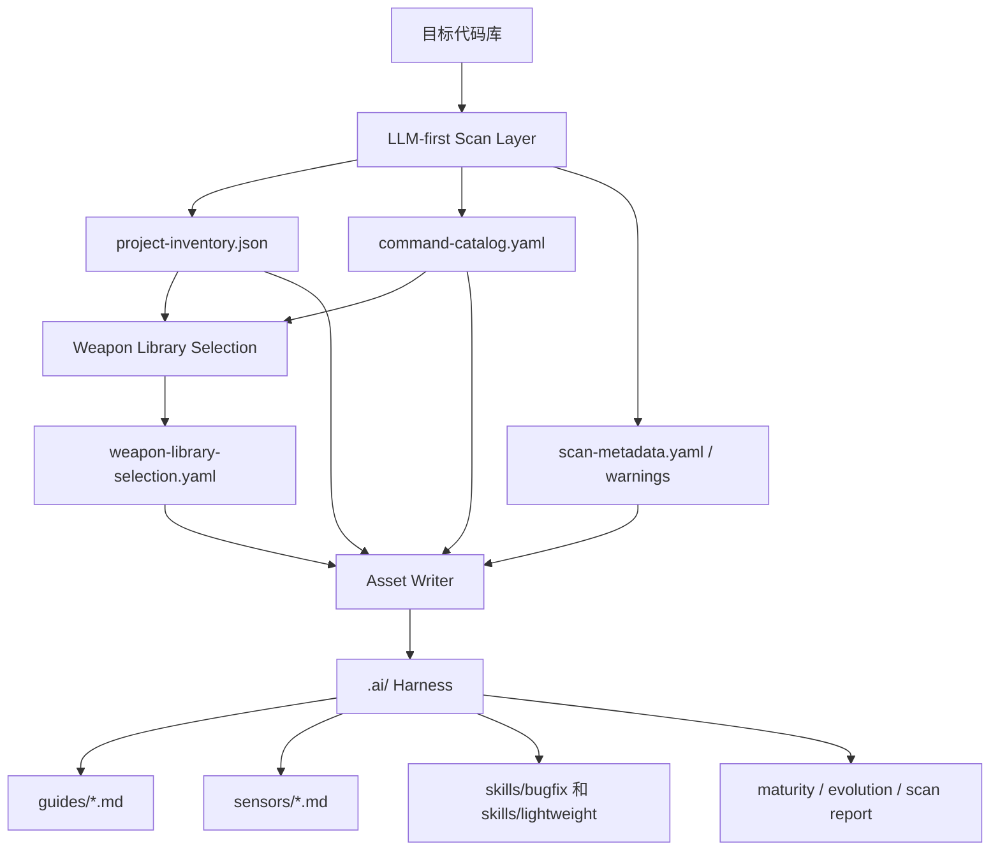
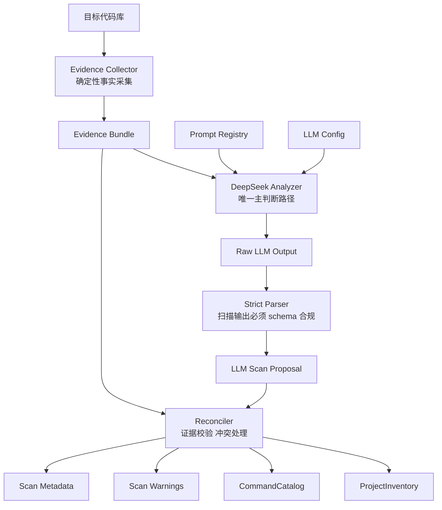

# Harness Builder — POC 方案设计

> 文档状态：POC 最新同步稿
> 目标用途：内部方案讨论、原型验收、后续目标模式执行依据
> 当前阶段：Harness Builder Agent CLI POC
> 更新时间：2026-05-30

---

## 1. POC 定位

Harness Builder POC 的目标，是为既有企业代码库生成一套项目级 AI Coding Harness，使 AI Coding Agent 能在更明确的项目上下文、规范边界、工作流和验证约束下工作。

当前 POC 不再保留独立的旧 Scanner Skill 路线。当前产品入口是 `harness-builder-agent` CLI，核心命令包括：

- `init`：扫描目标仓库并生成项目级 `.ai/` Harness。
- `run`：基于具体任务生成 `harness-map.yaml` 并执行选中的 Sensor。
- `assess`：生成或更新成熟度评估。
- `improve`：生成待确认的改进候选。
- `benchmark`：对生成产物、schema、内容质量和执行结果做验收。

当前 POC 的主路径是：

```text
目标仓库 → LLM-first 扫描 → 武器库匹配 → .ai Harness 生成 → Workflow / Sensor / Benchmark 验收
```

---

## 2. 当前 POC 成功标准

POC 成功需要证明：

1. 能在 Java Spring 和 .NET ASP.NET 真实/示例仓库中运行。
2. 扫描层以 DeepSeek 为主判断来源，不依赖脆弱的目录命名假设。
3. DeepSeek 不可用、无 API key、返回不合规时必须失败，不允许 fallback。
4. 生成 `.ai/` 下的结构化资产和语义上下文资产。
5. Workflow Skills 以固定内置模板复制到目标仓库，用户可见、可编辑。
6. Guides / Sensors 通过内置武器库稳定组装，而不是每次让大模型自由生成。
7. Sensor hard gate 需要真正影响 benchmark 结果。
8. 测试策略覆盖扫描、武器库、资产生成、CLI 编排、Sensor、Benchmark 和真实 DeepSeek 验收。

---

## 3. `init` 主链路

`init` 是当前 POC 的根命令，负责把目标仓库初始化为一个带 Harness 的仓库。



`init` 的职责：

- 调用扫描层，获得目标仓库的结构化现状。
- 调用武器库选择层，选择 `common + stack-specific` 的 Guides / Sensors 条目。
- 写出 `.ai/` 项目级 Harness 资产。
- 复制内置 Workflow Skills。

`init` 不负责：

- 不根据具体任务选择 workflow。
- 不执行 sensor。
- 不生成 task-run。
- 不做人工向导式确认的完整交互；本轮只预留兼容设计。

---

## 4. LLM-first 扫描层设计

扫描层必须从“确定性脚本猜测代码库结构”转为“确定性脚本采集事实，DeepSeek 负责主判断，Reconciler 负责校验合并”。



### 4.1 Evidence Collector

职责：只采集客观事实，不做复杂判断，不生成最终技术栈结论。

输入：

- repo path
- ignore rules
- 采样限制，例如最大文件数、最大文件大小、最大片段长度

输出：

- 文件树摘要
- 语言和扩展名统计
- 构建文件路径与摘要，例如 `pom.xml`、`.sln`、`.csproj`、`package.json`
- 配置文件路径与摘要，例如 `application*.yml`、`appsettings*.json`、`.env.example`
- CI 文件路径与摘要
- README / docs 摘要
- 代表性源码片段
- 采样和截断记录

### 4.2 DeepSeek Analyzer

职责：基于 Evidence Bundle 做主判断，输出严格结构化的 `LLMScanProposal`。

必须判断：

- `primary_stack`
- `stacks`
- `modules`
- `architecture_signals`
- `risk_areas`
- `command_candidates`
- `configs`
- `ci_files`
- `confidence`
- `needs_human_confirmation`
- `reasoning_summary`

要求：

- DeepSeek API key 必须存在。
- API 调用失败必须失败。
- 返回无法解析必须失败。
- 返回不符合 schema 必须失败。
- 不允许 fallback 到确定性扫描。

### 4.3 Reconciler

职责：合并 LLM 判断和确定性 evidence，输出后续程序可消费的 `ProjectInventory` 和 `CommandCatalog`。

规则：

- LLM 是主判断来源。
- 确定性 evidence 负责校验、降置信度、增加 warning 和必要的 veto。
- 只有极硬事实才允许 veto。例如 LLM 判断为 .NET，但仓库没有任何 `.sln`、`.csproj`、`.cs` 证据。
- LLM 给出的命令只有在 evidence 中有支撑时才可以成为 hard gate。
- 无证据支撑的命令只能作为 soft/candidate，并需要人工确认。
- 冲突不能静默吞掉，必须进入 warnings / metadata。

### 4.4 Scan Facade

`scan_repository(repo)` 对其他层保持稳定接口，内部改为：

```text
collect_evidence → analyze_with_deepseek → parse strict proposal → reconcile → ProjectInventory + CommandCatalog
```

---

## 5. 输出产物分级

产物格式严格度不按“人类消费还是机器消费”区分，而按下游是否需要确定性解析和执行区分。

| 类型 | 下游消费方式 | 格式要求 | 示例 |
|---|---|---|---|
| 确定性执行型 | 程序 parse、反序列化、执行、决策 | 必须严格 schema，失败即失败 | `project-inventory.json`、`command-catalog.yaml`、`harness-map.yaml`、`sensor-report.yaml` |
| 语义上下文型 | LLM / AI IDE 作为上下文理解 | 可以 Markdown / 文本，但章节稳定、证据可追溯 | `guides/*.md`、`sensors/*.md`、`skills/*/SKILL.md` |
| 审计追踪型 | 调试、复盘、验收 | 可以 JSON/YAML/Markdown，但必须完整记录来源和状态 | `scan-metadata.yaml`、`llm-trace.yaml`、`benchmark-report.yaml` |

---

## 6. 武器库和 Workflow Skills

Guides / Sensors 不让大模型每次自由生成。当前 POC 使用内置武器库：

- `common`
- `java-spring`
- `dotnet-aspnet`

扫描结果负责驱动武器库选择。生成结果必须写出：

- `.ai/weapon-library-selection.yaml`
- Guides 中的 weapon id 引用
- Sensors 中的 weapon id 引用

Workflow Skills 当前固定内置：

- `.ai/skills/bugfix/SKILL.md`
- `.ai/skills/lightweight/SKILL.md`

它们在 `init` 阶段复制到目标仓库，保持用户可见、可编辑、可定制。

---

## 7. 人工向导预留

理想形态中，Harness Builder 应该是向导式构建过程：

```text
扫描 → 生成 draft → 向用户询问组织规范/架构约束/团队习惯 → 用户确认 → 生成最终 Harness
```

当前 POC 不实现完整交互式向导，但设计必须预留：

- `needs_human_confirmation`
- `warnings`
- `manual_confirmation_points`
- `scan-metadata.yaml`
- 未来可加入 `approved-harness-inputs.yaml`

---

## 8. DeepSeek 和 CI 策略

当前 POC 的真实扫描必须依赖 DeepSeek。

规则：

- 本地运行真实扫描时，没有 `DEEPSEEK_API_KEY` 直接失败。
- DeepSeek 调用失败直接失败。
- DeepSeek 返回不合规直接失败。
- 不允许 deterministic fallback。
- CI 默认不跑真实 DeepSeek 测试。
- CI 使用 mock LLM 覆盖 Analyzer / Reconciler / `init` 逻辑。
- 本地 acceptance 测试必须跑真实 DeepSeek，无 key 失败。

---

## 9. 测试策略

测试策略按照逻辑层分层建立。

| 层次 | 测试职责 |
|---|---|
| Evidence Collector 单测 | 文件树、关键文件、配置、CI、源码片段、采样和截断 |
| DeepSeek Analyzer 单测 | mock LLM 成功、坏 JSON、缺字段、schema 错误、无 key 失败 |
| Reconciler 单测 | 一致合并、冲突 warning、极硬事实 veto、无证据命令降级 |
| Scan Facade 单测 | 扫描门面串联 collector/analyzer/reconciler |
| `init` 集成测试 | `.ai` 资产完整生成、schema 合法、武器库引用正确 |
| Sensor 单测 | passed/failed/skipped/timeout，hard gate 行为明确 |
| Benchmark 集成测试 | 文件存在、schema、内容质量、weapon selection、sensor hard gate |
| 真实仓库 E2E | RuoYi-Vue 和 eShopOnWeb 完整链路 |
| 真实 DeepSeek acceptance | 真实 DeepSeek 参与扫描，缺 key 失败 |

---

## 10. 当前 POC 范围外

本轮不做：

- 完整交互式人工向导。
- 动态生成 Workflow Skills。
- 动态生成武器库。
- IDE runtime 集成。
- 自动修改业务代码。
- 宿主 Agent 热加载或 runtime extension。

---

## 11. 下一阶段实施目标

下一阶段以 TDD 执行：

1. 建立 LLM-first 扫描层。
2. 删除确定性扫描主判断路径。
3. 增加 evidence / prompt / config / trace / warning / metadata 结构。
4. 将 `init` 接入新的扫描层。
5. 将 DeepSeek smoke 改造为真实扫描 acceptance，而不是 API ping。
6. 将 sensor hard gate 纳入 benchmark 结果。
7. 补齐各层测试，保证后续功能迭代有稳定保护网。
