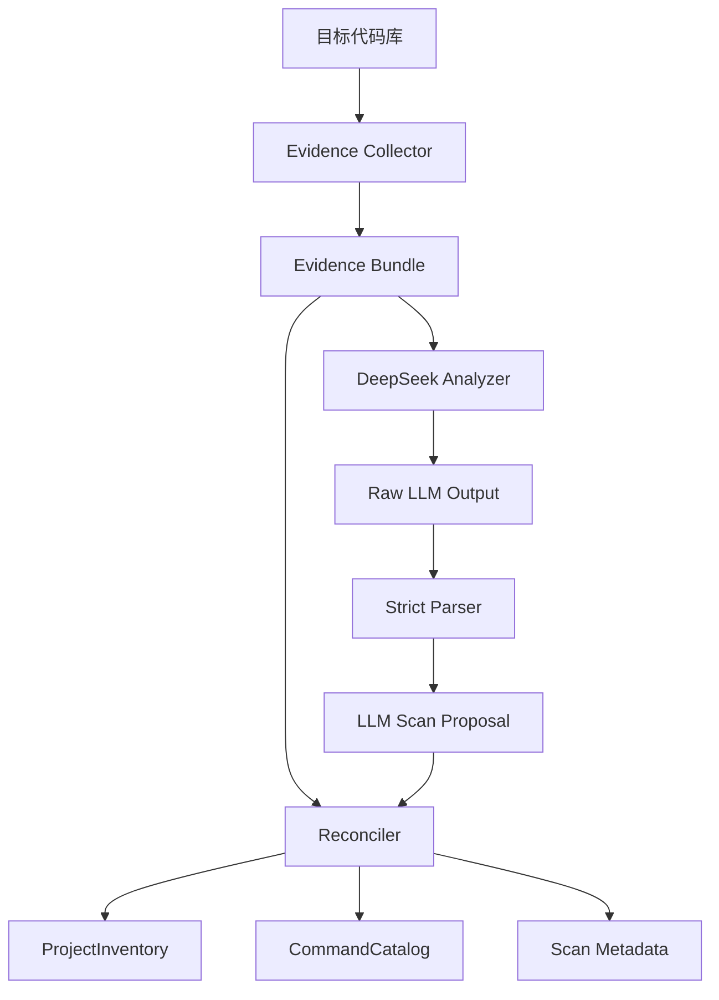

# LLM-first Scan Layer 设计

## 背景

当前 `harness-builder-agent init` 已经能生成 `.ai/` Harness，但扫描层仍以确定性脚本为主。它通过 `pom.xml`、`.sln`、`src/test`、路径是否包含 `test` 等规则判断技术栈、模块和命令。这对规整 fixture 可用，但不适合企业真实代码库。

本设计将扫描层改为 LLM-first：确定性逻辑只采集 evidence，DeepSeek 是唯一主判断路径，Reconciler 负责把 LLM 判断和证据合并成严格 schema 输出。

## 目标

- DeepSeek 不可用、无 key、返回不合规时扫描失败。
- 不允许 fallback 到确定性扫描。
- Evidence Collector 只采集事实，不做最终技术栈判断。
- LLM 输出的执行型数据必须严格 schema 校验。
- Reconciler 输出 `ProjectInventory`、`CommandCatalog`、warnings 和 metadata。
- `init` 继续作为外部入口，内部切换到新扫描层。
- CI 使用 mock LLM，不跑真实 DeepSeek；本地 acceptance 使用真实 DeepSeek，无 key 失败。

## 非目标

- 不实现完整人工向导式确认流程。
- 不动态生成武器库或 Workflow Skills。
- 不引入 IDE runtime。
- 不保留 deterministic fallback 或 `--offline` 模式。

## 架构



## 子层职责

### Evidence Collector

输入：repo path、ignore rules、采样限制。

输出：`EvidenceBundle`，包括文件清单、扩展名统计、关键文件摘要、配置文件摘要、CI 文件摘要、文档摘要、源码片段、截断记录。

职责边界：只采集客观事实，不判断最终技术栈、模块职责或命令 gate。

### DeepSeek Analyzer

输入：`EvidenceBundle`、prompt version、LLM config。

输出：`LLMScanProposal`。

失败条件：缺 key、调用失败、返回非 JSON、schema 不合规。

### Reconciler

输入：`EvidenceBundle`、`LLMScanProposal`。

输出：`ProjectInventory`、`CommandCatalog`、warnings、metadata。

规则：

- LLM 是主判断来源。
- evidence 用于校验、降置信度、warnings 和极少数 veto。
- 无 evidence 支撑的命令不得成为 hard gate。
- 冲突必须可审计。

### Scan Facade

`scan_repository(repo)` 保持外部接口稳定，内部顺序为：

```text
collect_evidence → analyze_with_deepseek → parse proposal → reconcile_scan
```

## 产物分级

确定性执行型产物必须严格 schema，包括：

- `project-inventory.json`
- `command-catalog.yaml`
- `weapon-library-selection.yaml`
- `harness-config.yaml`
- `harness-map.yaml`
- `sensor-report.yaml`
- `maturity-score.yaml`
- `benchmark-report.yaml`
- `llm-scan-proposal.json`
- `scan-metadata.yaml`

语义上下文型产物可以是 Markdown，但必须章节稳定、证据可追溯，包括：

- `guides/*.md`
- `sensors/*.md`
- `skills/*/SKILL.md`
- `maturity-report.md`
- `evolution-plan.md`
- `decision-log.md`
- `handoff-summary.md`

## 可观测性

扫描必须记录：

- prompt version
- model
- base URL，不含 API key
- evidence 文件数量和截断情况
- LLM response parse status
- warnings
- reconciler 决策摘要

## 测试策略

- Evidence Collector：文件采集、ignore、摘要、截断。
- DeepSeek Analyzer：mock 成功、无 key、坏 JSON、schema 错误。
- Reconciler：一致、冲突、veto、命令 gate 降级。
- Scan Facade：串联成功和失败路径。
- `init` 集成：`.ai` 资产仍完整生成。
- Real DeepSeek acceptance：真实模型参与扫描，无 key 失败。
- Benchmark：hard gate sensor 失败或跳过必须导致 benchmark failed。

## 验收标准

- `init` 不再使用确定性扫描结果作为主判断。
- 无 `DEEPSEEK_API_KEY` 时真实扫描失败。
- mock LLM 下 CI 测试可通过。
- Java / .NET fixture 通过 mock LLM 完成完整 `.ai` 生成。
- RuoYi-Vue / eShopOnWeb 本地 acceptance 可使用真实 DeepSeek 扫描。
- Sensor hard gate 失败或跳过不会被 benchmark 放过。
